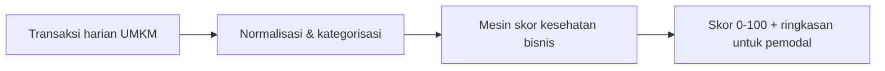

# Standar Penulisan Catatan Vault

Berlaku untuk seluruh berkas `.md` di vault RetailMind AI. Vault ini dibaca juri dan anggota
tim yang tidak ikut menulis, jadi catatan yang bisa dipindai dan bisa dilacak sumbernya lebih
berharga daripada catatan yang panjang.

## 1. Frontmatter

```markdown
---
title: Judul Catatan Tanpa Nomor Folder
aliases: [Sebutan Pendek, Nama Lain]
tags: [retailmind, <topik>, <jenis-dokumen>]
status: aktif
updated: <YYYY-MM-DD, tanggal kamu menyunting>
---
```

- `title` tanpa nomor urut, karena nomor hidup di nama berkas. `aliases` hanya kalau catatan
  memang dipanggil dengan nama lain; kalau tidak, hapus barisnya.
- `tags` selalu dibuka `retailmind`, lalu topik dan jenis. Huruf kecil, pakai tanda hubung.
  `status` diisi `aktif`, `draf`, atau `arsip`.
- `updated` wajib diperbarui tiap kali isi berubah. Ambil tanggal dari sistem, jangan menebak
  dan jangan menyalin tanggal catatan lain.

Dashboard dan proposal boleh menambah kunci lain (`event`, `tim`). Jangan menghapus kunci yang
sudah ada di catatan lama.

Salah: `Title: 07 - Scoring Engine` dengan `tag: scoring`, tanpa `status` dan `updated`.
Kesalahannya kunci berkapital, kunci salah tulis, nomor folder masuk judul, dua kunci hilang.

## 2. Penamaan berkas mengikuti penomoran folder

Pola `NN - Judul Catatan.md`, dengan `NN` melanjutkan urutan di folder tujuan. Varian
pendalaman memakai huruf: `04a`, `04b`, `11b`. Folder induk sudah bernomor, jadi nomor berkas
cukup unik di dalam foldernya.

- Benar: `06 - Validasi Pasar/05 - Blueprint Versi Telegram (Chat).md`
- Salah: `06 - Validasi Pasar/blueprint-telegram.md` (tanpa nomor, tidak terurut)
- Salah: menaruh catatan riset pasar di `03 - Solusi & Produk` (folder tidak cocok isi)

Lihat isi folder sebelum memberi nomor. Jangan memakai nomor yang sudah terpakai, dan jangan
menomori ulang catatan lama karena itu memutus semua wikilink yang mengarah ke sana.

## 3. Wikilink dan tautan dua arah

Rujukan antarcatatan selalu `[[Nama Berkas Tanpa .md]]`, persis termasuk nomornya. Jangan
memakai tautan Markdown biasa dan jangan menulis nama catatan sebagai teks polos.

Tambah tautan pada tiga situasi ini saja: (1) catatan menyebut angka, klaim, atau istilah yang
definisinya hidup di catatan lain; (2) pembaca kemungkinan besar ingin melanjutkan ke catatan
itu; (3) catatan baru belum punya jalan masuk, jadi daftarkan di `[[00 - Beranda (MOC)]]`. Dua
arah berarti kalau catatan A merujuk B sebagai sumber, B menaruh tautan balik ke A di baris
navigasi penutup, sehingga tidak ada catatan yatim.

```markdown
→ Kembali: [[00 - Beranda (MOC)]] · Terkait: [[07 - Scoring Engine]] · Angka: [[Sumber & Asumsi Angka]]
```

## 4. Callout Obsidian

Pakai callout untuk menandai fungsi paragraf, bukan sebagai hiasan.

| Callout | Dipakai untuk |
|---|---|
| `abstract` | Blok pembuka: tujuan catatan dalam satu paragraf. Hampir setiap catatan punya ini. |
| `tip` | Saran praktis, jalan pintas, pilihan jalur baca. |
| `success` | Hal yang sudah terbukti, sudah jalan, atau sudah tervalidasi. |
| `todo` | Pekerjaan belum selesai dan siapa menunggu apa. |
| `info` | Konteks tambahan yang berguna tetapi bukan inti argumen. |
| `warning` | Risiko, batas klaim, asumsi rapuh, hal yang bisa dipatahkan juri. |

Benar:

```markdown
> [!abstract] Tujuan dokumen
> Menjelaskan cara skor kesehatan bisnis dihitung dan dari data apa saja.

> [!warning] Batas klaim
> Skor ini belum dipakai lembaga pembiayaan mana pun sebagai dasar keputusan kredit.
```

Salah: `> [!success] Produk kami luar biasa dan pasti menang`. Kesalahannya callout dipakai
memuji diri sendiri, isinya tidak bisa diperiksa, dan `success` menandai yang belum terbukti.

## 5. Diagram Mermaid untuk alur

Alur, arsitektur, dan urutan proses digambar dengan Mermaid, bukan paragraf berlapis. Label
node dalam bahasa Indonesia, diagram muat satu layar.



Kalau alurnya cuma dua langkah, tulis kalimat biasa. Diagram yang isinya sama dengan paragraf
di atasnya adalah pengulangan, bukan penjelasan.

## 6. Tabel untuk perbandingan

Pakai tabel begitu ada tiga hal atau lebih yang dibandingkan pada dimensi yang sama: pilihan
solusi, segmen, paket harga, persona terhadap aspek, atau klaim terhadap sumbernya. Kolom
pertama hal yang dibandingkan, sisanya dimensi penilaian, isi sel satu frasa. Jangan memakai
tabel untuk daftar yang tidak dibandingkan.

## 7. Bahasa Indonesia yang lugas

- Kalimat aktif, satu gagasan per kalimat. Pecah kalimat yang lebih dari dua baris.
- Istilah teknis baku boleh tetap Inggris (dashboard, onboarding, scoring engine), tetapi
  jelaskan sekali saat pertama muncul. Jangan menumpuk jargon dalam satu kalimat.
- Buang bahasa pemasaran seperti "revolusioner" atau "game changer", ganti dengan pernyataan
  yang bisa diperiksa. Tulis untuk pembaca yang belum tahu apa-apa soal proyek ini, karena juri
  memang begitu.

Salah: "Solusi revolusioner berbasis AI yang secara disruptif mentransformasi ekosistem UMKM
F&B nasional." Benar: "Mengubah transaksi harian UMKM F&B menjadi skor kesehatan bisnis 0-100
yang bisa dibaca pemodal."

## 8. Setiap angka wajib punya rujukan

Tidak ada angka tanpa asal-usul. Sertakan sumbernya di kalimat atau sel tabel yang sama, dan
pastikan cocok dengan `[[Sumber & Asumsi Angka]]`. Tandai jenisnya: tersitasi (ada sumber
eksternal), keputusan internal (harga atau target tim), estimasi internal (belum ada sumber
eksternal), atau turunan (hasil hitungan dari angka lain).

Benar: "Sekitar [angka] persen UMKM masih mencatat manual ([[Sumber & Asumsi Angka]],
tersitasi). Target adopsi [angka] usaha dalam tiga tahun adalah target internal, bukan
proyeksi bersumber eksternal."

Salah: "Pasar kami bernilai puluhan triliun dan kami akan meraih 10% dalam setahun." Angka
tanpa sumber, tanpa penanda jenis, klaim pertumbuhan tak terbukti. Kalau sumbernya belum ada,
tulis placeholder `[angka]` dan catat di `> [!todo]` bahwa angkanya masih dicari. Jangan
pernah mengarang nilai supaya kalimat terasa lengkap.

## 9. Panjang catatan dan judul bertingkat

- Satu catatan satu topik. Kalau sudah melewati sekitar 150 baris dan topiknya bercabang,
  pecah jadi catatan varian (`04a`, `04b`) lalu hubungkan dengan wikilink.
- `##` untuk bagian utama, `###` untuk rincian. Jangan turun ke `####` kecuali perlu, jangan
  melompati tingkat. Penomoran judul (`## 1.`) untuk catatan panjang yang dirujuk per bagian.
- Judul harus bisa dipindai sendirian: pembaca yang hanya membaca daftar judul sudah paham
  alurnya. "Batasan dan rencana validasi lapangan" berguna, "Penjelasan lanjutan" tidak. Emoji
  pada judul secukupnya mengikuti pola catatan yang ada, maksimal satu per judul.

## 10. Periksa sebelum selesai

1. Frontmatter lengkap, `updated` diperbarui, nama berkas bernomor dan foldernya tepat.
2. Semua wikilink mengarah ke berkas yang ada, catatan bisa dicapai dari
   `[[00 - Beranda (MOC)]]`, dan ada baris navigasi penutup.
3. Setiap angka punya rujukan dan cocok dengan `[[Sumber & Asumsi Angka]]`.
4. Tidak ada klaim yang lebih besar daripada buktinya, khususnya soal skor kredit, kelayakan
   pendanaan, dan kemitraan lembaga keuangan.

> Diadaptasi dari [everything-claude-code](https://github.com/WorldFlowAI/everything-claude-code) (MIT) untuk vault RetailMind AI.
