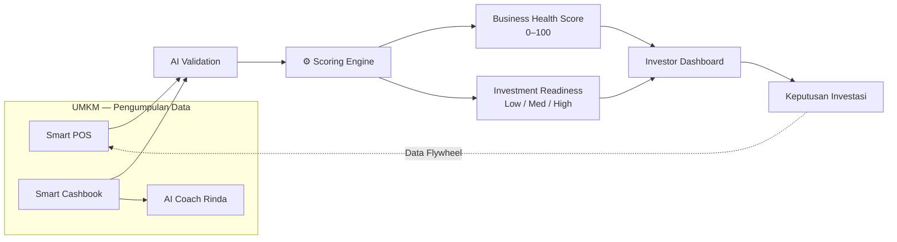

> [!abstract] RetailMind AI — Peta Dokumentasi (MOC)
> **Platform Business Health Scoring untuk UMKM F&B Indonesia.** Mengubah transaksi harian menjadi skor kesehatan bisnis yang dipercaya investor.
> **Tagline:** *Setiap Transaksi Membangun Kepercayaan.*
> Dokumentasi ini adalah pusat (Map of Content) untuk pitch, riset, produk, dan submission Tahap 2.

## 🎯 Mulai dari sini

> [!tip] Untuk juri / pembaca cepat
> Baca berurutan: [[01 - Ringkasan Eksekutif]] → [[08 - Keunggulan & Diferensiasi]] → [[13 - Pitch & Antisipasi Juri]].

## 🗺️ Peta Produk

> [!tip] Kanvas interaktif: buka [[Peta Produk.canvas]] (klik untuk peta visual yang bisa digeser-zoom)

## 📚 Struktur Dokumentasi

### 1. Ringkasan
- [[01 - Ringkasan Eksekutif]] — masalah → solusi → dampak, angka kunci, elevator pitch

### 2. Riset & Masalah
- [[02 - Masalah UMKM F&B]] — pain point pencatatan, kredibilitas, cashflow
- [[03 - Kebutuhan & Peran Investor]] — kenapa butuh investor, due diligence, risk
- [[04 - Riset Pasar F&B Indonesia]] — data pasar & financing gap (bersitasi)

### 3. Solusi & Produk
- [[05 - Ikhtisar Produk]] — positioning & alur dua sisi (UMKM ↔ Investor)
- [[06 - Modul Produk]] — 6 modul + status implementasi
- [[07 - Scoring Engine]] — Business Health Score & Investment Readiness Score

### 4. Keunggulan, Teknologi, Data
- [[08 - Keunggulan & Diferensiasi]] — moat & tabel kompetitor
- [[09 - Arsitektur & Teknologi]] — stack, diagram, keamanan
- [[10 - Data, Demo & Visualisasi]] — akun demo, data F&B, chart

### 5. Bisnis & Eksekusi
- [[11 - Business Model & GTM]] — model bisnis, revenue, go-to-market
- [[12 - Roadmap & Metrik Sukses]] — milestone & KPI
- [[13 - Pitch & Antisipasi Juri]] — narasi pitch + Q&A juri

### 6. Proposal & Submission Tahap 2
- [[15 - Proposal DIGDAYA 2026 (Ringkasan)]] — isi proposal resmi v2
- [[16 - Perbaikan Proposal]] — daftar perbaikan & rekonsiliasi data
- [[17 - Pertanyaan & Jawaban Tahap 2]] — draft jawaban form Tahap 2

### 7. Review
- [[14 - Penilaian Juri (Review)]] — hasil review kritis (juri internal)

## 👥 Tim

| Peran                 | Nama                           |
| --------------------- | ------------------------------ |
| Ketua Tim             | Hamzah Arman Husni             |
| Developer             | Dzaky Faishalariq              |
| Marketing Strategist  | Gregorius Bugen Jovi Sitindaon |
| Automation Specialist | Aditya Nurrohman               |
|                       |                                |

**Institusi:** Universitas Gadjah Mada · **Tim:** Financial Freedom Tim
**Event:** DIGDAYA X Hackathon — Pusat Inovasi Digital Indonesia (PIDI) 2026
**Penyelenggara:** Bank Indonesia · OJK · ASPI · Fintech Indonesia · APUVINDO · LPPI
