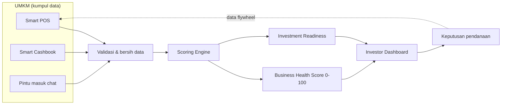

# 🏠 Dashboard Proyek: RetailMind AI

> [!abstract] Satu halaman untuk tahu seluruh proyek
> **RetailMind AI** adalah platform Business Health Scoring untuk UMKM F&B Indonesia. Mengubah transaksi harian menjadi skor kesehatan bisnis yang dipercaya pemodal.
> **Tagline:** Setiap transaksi membangun kepercayaan.
> **Lomba:** DIGDAYA X Hackathon PIDI 2026 (Bank Indonesia, OJK, ASPI, Fintech Indonesia, APUVINDO, LPPI). **Deadline: 26 Juli 2026.**
> Halaman ini adalah titik masuk tunggal. Kalau bingung harus baca apa, mulai dari sini.

## 🚦 Mulai dari mana (pilih jalurmu)

> [!tip] Punya 5 menit
> [[01 - Ringkasan Eksekutif]] lalu [[DISKUSI v3 - Ready to Win]]. Selesai, kamu paham inti dan arah.

> [!tip] Kamu juri atau pembaca baru
> Baca berurutan: [[01 - Ringkasan Eksekutif]] → [[02 - Masalah UMKM F&B]] → [[05 - Ikhtisar Produk]] → [[07 - Scoring Engine]] → [[08 - Keunggulan & Diferensiasi]] → [[Jawaban Tahap 3 (FINAL)]].

> [!tip] Kamu tim, mau tahu posisi dan langkah berikutnya
> [[DISKUSI v3 - Ready to Win]] → [[STATUS]] → [[04 - Laporan Validasi Sintetis]] → [[07 - Validasi Ulang Perubahan v2 (Multi-Agent)]] → [[Jawaban Tahap 3 (FINAL)]].

## 📊 Papan status proyek

> [!success] Deliverable submission: semua selesai
> Semua materi yang menentukan lolos Tahap 3 sudah siap. Item bertanda ⏳ di bawah adalah roadmap ke depan, bukan kekurangan submission, dan sudah tertulis jujur di proposal sebagai langkah berikutnya.

| Deliverable | Status | Catatan |
|---|---|---|
| Model skor (v2) | ✅ | Belanja stok jadi inventaris, bukan COGS. Lulus 19 dari 19 unit test. |
| Fitur Simulasi Belanja (What-If) | ✅ | Cek dampak belanja ke skor sebelum uang keluar. |
| Dashboard investor difokuskan | ✅ | Peta dihapus, fokus ke daftar, skor, readiness. |
| Aplikasi live | ✅ | Working prototype, bisa demo. |
| Validasi pasar (5 lensa) | ✅ | 6 persona UMKM + bank + investor + skeptis. |
| Dokumentasi dirapikan | ✅ | Folder 01-10 berurutan, arsip dipisah. |
| Jawaban Tahap 3 (proposal FIX) | ✅ | 24 field gap-closed + tabel celah ke langkah ke depan. |
| Konsep video elevator pitch | ✅ | Storyboard, script 70 detik, editing, bagian yang boleh pakai AI. |

> [!todo] Perlu kamu isi sebelum submit (hanya pemilik yang bisa)
> Link video YouTube publik, URL demo, file PDF proposal, dan link CV atau LinkedIn empat anggota. Semua placeholder ada di [[Jawaban Tahap 3 (FINAL)]].

> [!info] Roadmap ke depan (bukan kekurangan, sudah tertulis di proposal)
> - **Mitra pembiayaan (LOI):** milestone pilot, sekaligus "The Ask" ke penyelenggara. Bukan syarat lomba sekarang.
> - **Fitur sisi bank di aplikasi:** SLIK, kolektibilitas, login bank, ekspor. Dibangun saat pilot.
> - **Penguatan anti-gaming:** perkuat bobot Inventory Turnover.
> - **Verifikasi data independen:** sambungkan mutasi rekening, QRIS, atau agregator pembayaran.

## 🗺️ Peta produk

## 📁 Struktur folder (urutan baca)

| Folder | Isi | Dokumen kunci |
|---|---|---|
| **01 - Ringkasan** | Intisari proyek | [[01 - Ringkasan Eksekutif]] |
| **02 - Riset & Masalah** | Masalah, pasar, persona | [[02 - Masalah UMKM F&B]] · [[04c - TAM SAM SOM]] |
| **03 - Solusi & Produk** | Produk dan mesin skor | [[05 - Ikhtisar Produk]] · [[07 - Scoring Engine]] |
| **04 - Keunggulan & Teknologi** | Moat, arsitektur, data | [[08 - Keunggulan & Diferensiasi]] · [[09 - Arsitektur & Teknologi]] |
| **05 - Bisnis & Eksekusi** | Model bisnis, proyeksi, roadmap | [[11 - Business Model & GTM]] · [[11b - Proyeksi Finansial 3 Tahun]] |
| **06 - Validasi Pasar** | Bukti validasi multi-agent | [[04 - Laporan Validasi Sintetis]] · [[Strategi Validasi PMF]] · [[STATUS]] |
| **07 - Proposal & Submission** | Proposal resmi dan jawaban | [[Jawaban Tahap 3 (FINAL)]] · [[20 - One-Pager & The Ask]] |
| **08 - Pitch & Presentasi** | Naskah, skrip, konsep video | [[Konsep Video Elevator Pitch (Tahap 3)]] · [[13 - Pitch & Antisipasi Juri]] · [[Naskah Pitch 60 Detik]] |
| **09 - Modul Hackathon** | Isian modul panitia | [[00 - Analisis Modul & Rekomendasi]] |
| **10 - Strategi & Review** | Arah v3 dan review juri | [[DISKUSI v3 - Ready to Win]] · [[Mindmap v3 - Ready to Win]] |
| **99 - Kanvas & Referensi** | Kanvas visual, sumber angka, perkakas | [[Sumber & Asumsi Angka]] · [[Peta Produk.canvas]] · [[Perkakas Claude Code (Panduan Vault)]] |

## ❓ Keputusan yang menunggu kamu

Rincian dan bahan diskusi ada di [[DISKUSI v3 - Ready to Win]] bagian 6.
- **Nama brand final:** tetap "RetailMind" atau ganti (nama sedang dipakai pihak lain).
- **Segmen:** empat (warung, kafe, restoran, catering) atau bakery dikembalikan resmi.
- **Urutan kerja:** dahulukan fitur sisi bank atau kejar penjajakan mitra.
- **Lingkup demo v3:** fitur mana masuk demo, mana cukup roadmap.

## 👥 Tim

| Peran                   | Nama                           |
| ----------------------- | ------------------------------ |
| Ketua Tim / AI Engineer | Hamzah Arman Husni             |
| Developer               | Dzaky Faishalariq              |
| Marketing Strategist    | Gregorius Bugen Jovi Sitindaon |
| Automation Specialist   | Aditya Nurrohman               |

**Institusi:** Universitas Gadjah Mada · **Tim:** Financial Freedom Tim
**Event:** DIGDAYA X Hackathon, Pusat Inovasi Digital Indonesia (PIDI) 2026
**Penyelenggara:** Bank Indonesia · OJK · ASPI · Fintech Indonesia · APUVINDO · LPPI
