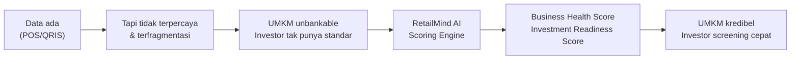

> [!quote] Elevator Pitch (30 detik)
> 65 juta UMKM adalah tulang punggung ekonomi Indonesia, **tapi ~70% tak bisa mengakses kredit** — bukan karena bisnisnya lemah, melainkan karena **datanya tidak terpercaya.** RetailMind AI mengubah transaksi harian UMKM F&B menjadi **Business Health Score** dan **Investment Readiness Score** yang dapat dipercaya investor. *Setiap Transaksi Membangun Kepercayaan.*

## Masalah → Solusi → Dampak

## Dua Masalah, Satu Jembatan

> [!danger] Masalah UMKM F&B
> Sudah pakai POS/QRIS, tapi data terfragmentasi dan tidak bisa membuktikan performa ke investor. *"Data ada. Kepercayaan tidak ada."* → lihat [[02 - Masalah UMKM F&B]]

> [!danger] Masalah Investor
> Tidak ada standar penilaian objektif; due diligence manual mahal (2–4 minggu) dan tidak skalabel. → lihat [[03 - Kebutuhan & Peran Investor]]

## Solusi Inti (3 Modul Terintegrasi)

| Modul                     | Fungsi                          | Output                     |
| ------------------------- | ------------------------------- | -------------------------- |
| **Smart Data Collection** | POS + Cashbook + OCR Nota       | Data transaksi tervalidasi |
| **AI Analysis Engine**    | Health Score + AI Coach "Rinda" | Insight & skor 0–100       |
| **Investor Platform**     | Dashboard + Readiness Score     | Keputusan investasi cepat  |

Detail: [[05 - Ikhtisar Produk]] · [[06 - Modul Produk]] · [[07 - Scoring Engine]]

## Angka Kunci (untuk pitch)

> [!info] 8 angka terkuat (lihat sumber di [[04 - Riset Pasar F&B Indonesia]])
> - **65 juta UMKM** menyumbang **60,51% PDB** & menyerap **96,92%** tenaga kerja (Kemenkop UKM, 2024)
> - **69,5% UMKM** belum bisa akses kredit perbankan; **43,1%** butuh tapi belum terlayani (Kementerian UMKM, 2025)
> - **Gap pembiayaan UMKM ≈ Rp2.400 triliun** (kebutuhan Rp4.300T vs pasokan Rp1.900T, Kemenko, 2026) / **USD 234 miliar** (IFC)
> - Porsi kredit UMKM hanya **~19,8%** vs target **30%** (OJK, Des 2024)
> - **Kuliner = subsektor No.1 ekonomi kreatif** (~41–43% PDB ekraf); **4,85 juta** usaha makan-minum (BPS, 2023)
> - **P2P lending +27% YoY** (Rp75,6T), tapi porsi ke UMKM produktif baru **30,91%** vs target 40–50% (OJK)
> - **32 juta merchant QRIS** (95% UMKM) + **25,5 juta UMKM go-digital** (BI & Kemenkop, 2024)
> - Mayoritas UMKM tidak punya laporan keuangan rapi & mencampur keuangan pribadi-usaha (Bank Indonesia)

> [!note]- Klarifikasi: 69,5% vs 43,1%
> **69,5%** = UMKM yang **belum punya akses** kredit perbankan (termasuk yang belum membutuhkan). **43,1%** = bagian yang **membutuhkan kredit tetapi belum terlayani** (≈ *unmet demand*). Keduanya dari Kementerian UMKM (2025). Pakai 69,5% untuk besarnya populasi unbankable, 43,1% untuk besarnya permintaan riil yang gagal dilayani.

## Status

> [!success] WORKING PROTOTYPE — MVP sudah berjalan
> 6 modul aktif, 2 akun demo, data F&B Yogyakarta ter-seed. Siap demo live: data nyata → skor → keputusan investor. Detail: [[10 - Data, Demo & Visualisasi]]

## Tautan cepat
[[08 - Keunggulan & Diferensiasi]] · [[11 - Business Model & GTM]] · [[12 - Roadmap & Metrik Sukses]] · [[13 - Pitch & Antisipasi Juri]] · [[00 - Beranda (MOC)]]
