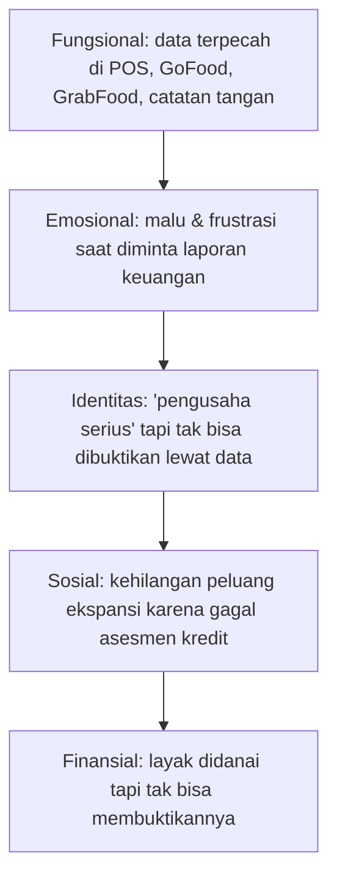

> [!summary] Inti masalah
> UMKM F&B (warung, kafe, bakery, catering; omzet Rp10–200 juta/bulan) **sudah punya data digital**, tetapi data itu terfragmentasi, tidak konsisten, dan **tidak bisa "bicara" ke investor.** Masalahnya bukan digitalisasi — tapi **data readiness & kredibilitas.**

## "Data ada. Kepercayaan tidak ada."

Riset lapangan tim ke **15 UMKM F&B Yogyakarta** (warung makan, kafe kecil, bakery rumahan): hampir semua sudah pakai aplikasi kasir digital. Tapi saat ditanya *"Berapa keuntungan bersih bulan lalu?"* — **tidak ada satu pun yang bisa menjawab pasti.** 100% tidak mampu menyajikan data terverifikasi 12 bulan terakhir.

## Lima Lapis Pain Point

| Lapis      | Pain                                             | Konsekuensi                    |
| ---------- | ------------------------------------------------ | ------------------------------ |
| Fungsional | Data terfragmentasi antar channel                | Tidak ada laporan terintegrasi |
| Emosional  | Tidak bisa jawab pertanyaan dasar bisnis sendiri | Hilang rasa percaya diri       |
| Identitas  | Tidak bisa membuktikan keseriusan usaha          | Dipandang "pedagang kecil"     |
| Sosial     | Gagal asesmen kredit                             | Peluang ekspansi hilang        |
| Finansial  | Layak didanai tapi tak terbukti                  | Terjebak skala kecil           |

## Jobs-to-be-Done UMKM

- **Functional:** "Bantu saya tahu apakah bisnis saya sehat."
- **Emotional:** "Buat saya percaya diri ketika bertemu investor."
- **Social:** "Tunjukkan ke orang lain bahwa bisnis saya serius dan terkelola."

## Bukti Empiris

> [!quote] Data pendukung (sumber lengkap di [[04 - Riset Pasar F&B Indonesia]])
> - **77%** UMKM masih mencatat manual/semi-manual (OCBC & NielsenIQ, 2024)
> - Hanya **~19%** UMKM punya laporan keuangan yang diterima lembaga formal (OJK)
> - Mayoritas UMKM **tidak memisahkan keuangan pribadi & usaha** (Bank Indonesia)
> - Digitalisasi data dapat meningkatkan akses kredit hingga **3,5×** (McKinsey, 2023)
> - **69,5% UMKM** belum bisa akses kredit perbankan (Kementerian UMKM, 2025)

## Bagaimana RetailMind Menjawab

Akar masalahnya adalah **kepercayaan data**, dan itu persis yang diatasi RetailMind: data harian yang tervalidasi (POS + Cashbook) → diolah jadi **skor** yang objektif → menjadi *track record* yang bisa ditunjukkan ke investor.

→ Solusi: [[05 - Ikhtisar Produk]] · [[07 - Scoring Engine]]
→ Sisi investor: [[03 - Kebutuhan & Peran Investor]]
→ Kembali: [[00 - Beranda (MOC)]]
