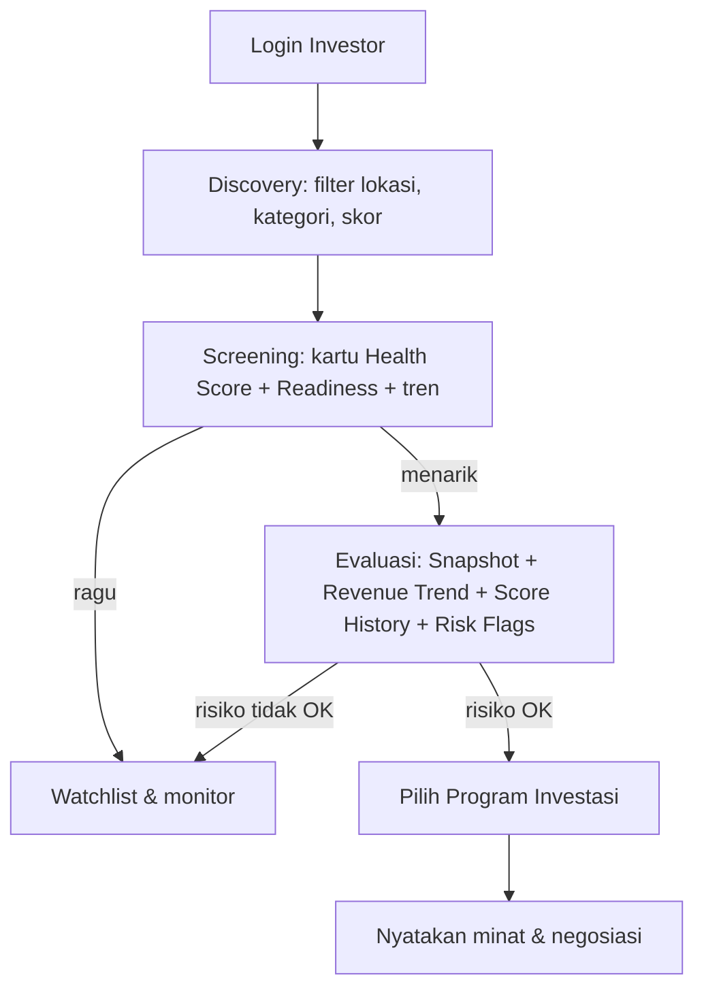

> [!summary] Inti
> Investor tidak kekurangan UMKM — mereka **kekurangan data yang bisa dipercaya.** RetailMind mengubah data operasional harian menjadi skor terstandar sehingga investor bisa **screening dalam menit, bukan minggu.**

## 1. Mengapa UMKM F&B butuh investor

Siklus modal F&B bersifat berulang, mendesak, dan sensitif waktu:
- **Modal kerja harian:** bahan baku *perishable*, gaji, utilitas, kemasan
- **Peralatan:** kompor, kulkas/freezer, display, mesin QRIS/POS
- **Ekspansi outlet:** deposit sewa (3–6 bulan di muka), renovasi, izin (PIRT, halal, NIB), stok awal
- **Modal musiman:** lonjakan Ramadan/Lebaran/Natal, pre-order grosir

**Tapi akses pembiayaan formal sulit:** tidak ada laporan keuangan, agunan F&B bernilai likuidasi rendah, belum punya track record SLIK, dan biaya asesmen kredit kecil secara proporsional mahal bagi bank.

## 2. Mengapa investor butuh data operasional nyata

Akar masalahnya **asimetri informasi** → memicu *adverse selection* (investor tak bisa bedakan UMKM sehat vs sekadar terlihat sehat) dan *credit rationing* (lender memilih tidak meminjamkan sama sekali).

> [!warning] Kenapa laporan keuangan manual tidak cukup
> | Kelemahan | Implikasi bagi investor |
> |---|---|
> | Tidak ada audit trail, angka mudah diubah | Omzet yang diklaim tak terverifikasi |
> | Pencatatan tidak konsisten | Tren tak bisa dipercaya |
> | Keuangan pribadi & bisnis campur | Profit sesungguhnya tak diketahui |
> | Tidak ada timestamp | Tak ada bukti bisnis benar beroperasi |

**Data transaksi harian (POS/cashbook) berbeda:** *immutable timestamp*, granular (deteksi pola harian), bisa *cross-validation* (revenue naik tapi pembelian bahan tidak → anomali), dan konsistensi sistemik membuktikan disiplin manajemen. Ini selaras dengan arah OJK soal **Innovative Credit Scoring (ICS)** — data alternatif (QRIS, transaksi digital) sebagai dasar penilaian kredit.

## 3. Due diligence → komponen skor RetailMind

Prinsip **5C** (Character, Capacity, Capital, Collateral, Condition) diterjemahkan ke data yang RetailMind hitung:

| Kriteria due diligence | Komponen Health Score | Komponen Readiness Score |
|---|---|---|
| Konsistensi omzet | Revenue Growth (25%) | Revenue Growth (20%) |
| Kemampuan bayar / cashflow | Cashflow Stability (20%) | Cashflow Stability (15%) |
| Profitabilitas / margin | Profitability (20%) | via Health Avg (30%) |
| Efisiensi pengeluaran | Expense Efficiency (15%) | via Health Avg (30%) |
| Perputaran stok | Inventory Turnover (10%) | via Health Avg (30%) |
| Loyalitas pelanggan | Customer Retention (10%) | via Health Avg (30%) |
| Umur usaha / track record | — | Operational Age (5%) |
| Kualitas & konsistensi data | — | Data Consistency 20% + Reporting Quality 10% |

Detail rumus: [[07 - Scoring Engine]]. **Health Score tinggi & stabil menjadi proksi prediktif Kol-1 (Lancar)** dalam skala kolektibilitas OJK, dan Readiness Score Medium/High setara *pre-screening* spirit KUR.

## 4. Risk indicators F&B yang ditampilkan ke investor

- **Kritis:** cashflow negatif 2 bulan beruntun · omzet turun 3 bulan beruntun · gross margin < 15–20% · expense ratio > 85%
- **Perlu investigasi:** volatilitas musiman tinggi · retensi pelanggan rendah · inventory days tinggi (stok mendekati kadaluarsa)
- **Red flag kepercayaan data:** data POS ≠ cashbook · durasi data < 90 hari · banyak entri tanpa kategori/nota

## 5. Alur keputusan investasi di platform

## 6. Nilai Readiness Score: turunkan biaya & risiko screening

Tanpa platform, due diligence konvensional **Rp5–15 juta & 2–4 minggu per UMKM**, dan 1 analis hanya sanggup 5–10 UMKM/bulan. Dengan RetailMind:
- **Standardisasi** — bandingkan UMKM antar-kota dengan metrik sama (apple-to-apple)
- **Hemat waktu screening 90%+** — filter `readiness_level` & `min_health_score`
- **Kepercayaan berbasis sistem** — `data_consistency_score` & `reporting_quality_score` mengukur kepercayaan data itu sendiri
- **Risk pre-qualification** via `risk_flags` + **program matching** otomatis + **portfolio monitoring** pasif

→ Sisi UMKM: [[02 - Masalah UMKM F&B]] · Data pasar: [[04 - Riset Pasar F&B Indonesia]] · Kembali: [[00 - Beranda (MOC)]]
