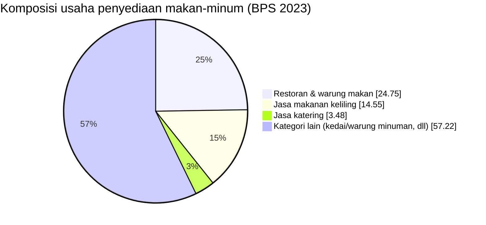

> [!summary] Mengapa riset ini penting
> Membuktikan bahwa masalah RetailMind **besar, nyata, dan terukur**: pasar UMKM F&B raksasa, financing gap menganga, infrastruktur digital sudah ada — yang hilang adalah **jembatan data tepercaya.**

## 1. Ukuran & kontribusi UMKM

| Indikator                   | Angka          | Tahun   | Sumber               |
| --------------------------- | -------------- | ------- | -------------------- |
| Jumlah UMKM                 | > 65 juta unit | 2024    | Kemenkop UKM         |
| Kontribusi ke PDB           | 60,51%         | 2024    | Kemenkop UKM         |
| Serapan tenaga kerja        | 96,92%         | 2024    | Kemenkop UKM         |
| Porsi dari total unit usaha | ~99%           | 2023–24 | The Jakarta Post     |
| Kontribusi ekspor nasional  | ~15,7%         | 2024    | Kemenko Perekonomian |

> [!note] Insight
> UMKM = tulang punggung ekonomi (99% unit usaha, 60,51% PDB, ~97% tenaga kerja), tapi ekspornya kecil → banyak yang belum "naik kelas".

## 2. Sektor F&B / Kuliner (pasar target)

| Indikator | Angka | Tahun | Sumber |
|---|---|---|---|
| Kontribusi kuliner ke PDB ekraf | 41,4%–43% (terbesar) | 2023 | Databoks/Katadata |
| Jumlah usaha penyediaan makan-minum | 4,85 juta (+21,13% sejak 2016) | 2023 | BPS |
| Tenaga kerja sektor makan-minum | 9,80 juta pekerja | 2023 | BPS |
| Pertumbuhan industri mamin | 5,53%–5,82% | 2024 | Kemenperin |
| Kontribusi mamin ke PDB industri nonmigas | 40,33% (terbesar) | 2024 | Kemenperin |

Komposisi usaha kuliner (BPS 2023):

## 3. Masalah pencatatan & literasi keuangan

| Indikator | Angka | Tahun | Sumber |
|---|---|---|---|
| Indeks literasi keuangan nasional | 65,43% | 2024 | OJK & BPS (SNLIK) |
| Indeks inklusi keuangan nasional | 75,02% | 2024 | OJK & BPS (SNLIK) |
| UMKM pencatatan manual/semi-manual | 77% | 2024 | OCBC & NielsenIQ |
| UMKM tanpa laporan keuangan rapi | "sebagian besar" (kualitatif) | — | Bank Indonesia |

> [!warning] Jangan diklaim sebagai angka presisi
> Tidak ada satu angka resmi tunggal "X% UMKM tanpa pembukuan". Sumber resmi (BI/Kemenkeu) bersifat kualitatif: "sebagian besar UMKM tidak memisahkan keuangan pribadi & usaha." Angka **77%** berasal dari OCBC & NielsenIQ 2024 (riset swasta) — aman dipakai dengan atribusi yang benar.

## 4. Financing / credit gap (bagian terkuat) ⭐

| Indikator | Angka | Tahun | Sumber |
|---|---|---|---|
| UMKM belum bisa akses kredit perbankan | 69,5% | 2025 | Kementerian UMKM |
| UMKM butuh kredit tapi belum terlayani | 43,1% | 2025 | Kementerian UMKM |
| MSME finance gap | USD 234 miliar | 2023–25 | IFC / SME Finance Forum |
| Kebutuhan pembiayaan UMKM | Rp4.300 triliun | proyeksi 2026 | Kemenko Perekonomian |
| Pasokan pembiayaan tersedia | Rp1.900 triliun | 2026 | Kemenko Perekonomian |
| **→ Gap (turunan)** | **≈ Rp2.400 triliun** | 2026 | turunan Kemenko |
| Porsi kredit UMKM dari total kredit bank | ~19,8% (Rp1.592T / Rp8.024T) | Des 2024 | OJK |
| Target pemerintah porsi kredit UMKM | 30% | target | OJK |

> [!info] Soal angka "Rp2.400 triliun"
> Ini **selisih turunan** kebutuhan (Rp4.300T) − pasokan (Rp1.900T) menurut Kemenko Perekonomian — aman bila ditulis "selisih kebutuhan vs pasokan ≈ Rp2.400T". Versi internasional: **USD 234 miliar** (IFC). Lihat [[16 - Perbaikan Proposal]] untuk koreksi atribusi.

Porsi kredit UMKM justru **menyusut** (~19,8%) jauh di bawah target 30% → masalah makin parah, bukan membaik.

> [!note] Klarifikasi 69,5% vs 43,1%
> **69,5%** = populasi UMKM yang belum punya akses kredit perbankan (termasuk yang belum butuh). **43,1%** = subset yang **butuh kredit tapi belum terlayani** (*unmet demand*). Bukan dua angka yang saling bertentangan — yang satu populasi, yang satu permintaan riil.

## 5. Tren fintech lending & investasi

| Indikator | Angka | Tahun | Sumber |
|---|---|---|---|
| Outstanding P2P lending | Rp75,60 triliun (+27,32% YoY) | Nov 2024 | OJK |
| Akun penerima pinjaman aktif | 14,7 juta | Feb 2025 | OJK |
| Porsi pembiayaan produktif/UMKM | 30,91% | Nov 2024 | OJK |
| Target porsi produktif/UMKM | 40–50% (mulai 2025) | 2025+ | OJK (Roadmap P2P) |
| Potensi UMKM belum terlayani | 46 juta | 2024–25 | OJK / Katadata |

> [!note] Insight
> Regulator mendorong fintech menyalurkan lebih banyak ke UMKM produktif (target 40–50%), tapi realisasi baru 30,91%. **Bottleneck-nya: tidak ada data kelayakan UMKM** — celah inti yang diisi RetailMind.

## 6. Adopsi digital & QRIS (momentum)

| Indikator | Angka | Tahun | Sumber |
|---|---|---|---|
| UMKM sudah go-digital | 25,5 juta | Jul 2024 | Kemenkop UKM |
| Merchant QRIS terdaftar | 32 juta | 2024 | Bank Indonesia |
| Porsi merchant QRIS yang UMKM | 95% | 2024 | Bank Indonesia |

Dari ~65 juta UMKM, baru **~39%** go-digital → ruang tumbuh besar. **Infrastruktur transaksi digital sudah masif, tapi datanya belum diolah jadi penilaian bisnis** — itulah yang RetailMind kerjakan.

## ⚠️ Yang perlu verifikasi (jangan diklaim pasti)
1. "% UMKM tanpa pembukuan" — tak ada angka resmi tunggal (hanya kualitatif).
2. Literasi keuangan khusus UMKM mikro — hanya "di bawah rata-rata nasional 65,43%".
3. Breakdown persentase per alasan penolakan kredit — hanya daftar kualitatif.
4. "Rp2.400T" adalah turunan, bukan kutipan langsung.

## Sumber

**Pemerintah & regulator**
- Kemenkop UKM — https://umkm.go.id/news/trujm0bu4rptb9nde9a8b09h
- BPS Statistik Penyediaan Makan-Minum 2023 — https://www.bps.go.id/en/publication/2024/12/23/f2c7743c4712aaeaa4abf694/statistik-penyediaan-makanan-dan-minuman-2023.html
- OJK SNLIK 2024 — https://ojk.go.id/id/berita-dan-kegiatan/siaran-pers/Pages/OJK-dan-BPS-Umumkan-Hasil-Survei-Nasional-Literasi-dan-Inklusi-Keuangan-Tahun-2024.aspx
- OJK Statistik Fintech — https://ojk.go.id/id/kanal/iknb/data-dan-statistik/fintech/default.aspx
- Indonesia.go.id (kredit UMKM) — https://indonesia.go.id/kategori/editorial/9971/
- Kemenkeu DJPb (laporan keuangan UMKM) — https://djpb.kemenkeu.go.id/kppn/solok/id/data-publikasi/artikel/3349-pentingnya-laporan-keuangan-bagi-umkm.html
- Kemenperin/Tempo (industri mamin) — https://www.tempo.co/ekonomi/industri-makanan-dan-minuman-tumbuh-5-53-persen-beri-sumbangan-terbesar-ke-pdb--12737

**Lembaga internasional**
- IFC MSME Finance — https://www.ifc.org/en/what-we-do/sector-expertise/financial-institutions/msme-finance
- SME Finance Forum (MSME Finance Gap) — https://www.smefinanceforum.org/data-sites/msme-finance-gap
- World Bank MSME Finance Gap — https://documents1.worldbank.org/curated/en/653831510568517947/pdf/121264-WP-PUBLIC-MSMEReportFINAL.pdf

**Media & data**
- Niaga.Asia (PDB & tenaga kerja) — https://www.niaga.asia/kontribusi-umkm-terhadap-pdb-indonesia-6051-persen-dan-serap-9692-tenaga-kerja/
- Databoks/Katadata (kuliner PDB ekraf) — https://databoks.katadata.co.id/ekonomi-makro/statistik/0196de4d2abcb4e/kuliner-penyumbang-pdb-ekonomi-kreatif-terbesar
- LinkUMKM (69,5% tak akses kredit) — https://linkumkm.id/news/detail/16314/
- Katadata (46 juta UMKM P2P) — https://katadata.co.id/digital/fintech/679187783fe62/
- ANTARA (25,5 juta go-digital) — https://www.antaranews.com/berita/4397157/kemenkop-ukm-255-juta-umkm-telah-go-digital
- The Jakarta Post (99% bisnis) — https://www.thejakartapost.com/opinion/2024/03/20/no-credit-no-progress.html

→ Kembali: [[00 - Beranda (MOC)]] · Terkait: [[02 - Masalah UMKM F&B]] · [[03 - Kebutuhan & Peran Investor]]
