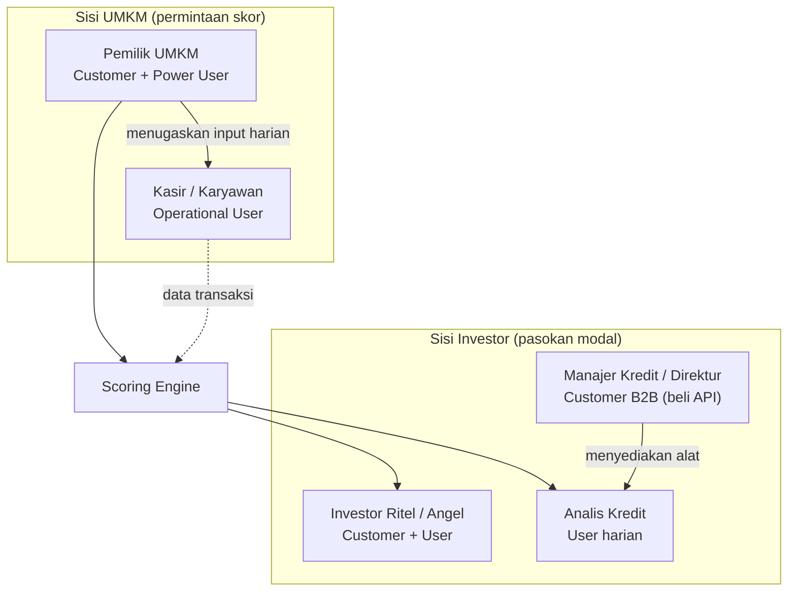

> [!abstract] Tujuan dokumen
> Memisahkan **siapa yang membayar (customer)** dari **siapa yang memakai (user)** pada platform dua sisi RetailMind AI, lalu memetakan mereka menjadi persona konkret lengkap dengan pain point yang berbasis riset. Dokumen ini melengkapi [[02 - Masalah UMKM F&B]] dan [[03 - Kebutuhan & Peran Investor]] dengan wajah manusianya, supaya keputusan produk, pitch, dan go-to-market punya sasaran yang jelas.

## 1. Customer bukan selalu User

RetailMind adalah *marketplace* dua sisi. Konsekuensinya, orang yang mengambil keputusan beli sering berbeda dari orang yang menyentuh aplikasi tiap hari. Kalau keduanya dicampur, kita salah sasaran: fitur dibuat untuk pembayar, padahal yang gagal memakainya adalah operator harian.

> [!info] Definisi kerja
> - **Customer (economic buyer):** memutuskan adopsi dan menanggung biaya (langganan Pro, akses investor, lisensi API).
> - **User:** berinteraksi langsung dengan produk. Bisa *power user* (butuh insight & keputusan) atau *operational user* (butuh input cepat & minim friksi).
> - **Beneficiary:** menerima manfaat tanpa membayar atau memakai secara langsung (misalnya regulator yang selaras dengan arah Innovative Credit Scoring OJK).

### Peta Customer to User

### Matriks singkat

| Aktor                   | Sisi     | Customer? | User?              | Yang dibayar      | Referensi harga |
| ----------------------- | -------- | --------- | ------------------ | ----------------- | --------------- |
| Pemilik UMKM            | UMKM     | ✅         | ✅ (power)          | Langganan Pro     | Rp 149.000/bln  |
| Kasir / karyawan        | UMKM     | ❌         | ✅ (operasional)    | (tidak membayar)  | n/a             |
| Investor ritel / angel  | Investor | ✅         | ✅                  | Investor Access   | Rp 299.000/bln  |
| Analis kredit lembaga   | Investor | ❌         | ✅ (harian)         | (dipakaikan alat) | n/a             |
| Manajer/Direktur kredit | Investor | ✅         | ❌ (sesekali lihat) | Lisensi API B2B   | Rp 2-5 juta/bln |

Sumber tier harga: [[11 - Business Model & GTM]].

> [!warning] Implikasi desain yang mudah terlewat
> Pembayar di sisi UMKM (pemilik) mengejar **skor dan kredibilitas**, tetapi yang paling sering membuka aplikasi bisa jadi **kasir** yang hanya butuh cepat menutup transaksi. Kalau input POS terasa berat bagi kasir, datanya bolong, dan skor yang diinginkan pemilik jadi tidak pernah terbentuk. Persona operasional wajib punya kartu sendiri.

---

## 2. Segmentasi & prioritas

Pasar target primer adalah UMKM F&B beromzet Rp10-200 juta per bulan (perkiraan 3-5 juta unit usaha, lihat [[11 - Business Model & GTM]]). Sisi sekunder adalah penyedia modal. Untuk pilot Yogyakarta, dua persona ini yang dikejar lebih dulu.

> [!tip] Urutan akuisisi (pilot 0-6 bulan)
> 1. **P2 Pemilik F&B bertumbuh** lebih dulu: paling termotivasi karena sedang butuh modal ekspansi, sudah digital, cepat teraktivasi.
> 2. **P4 Investor ritel/angel lokal** dan **P5 Analis BPR/Koperasi** sebagai sisi pasokan agar skor punya pembeli.
> 3. **P1 Pemilik warung tradisional** menyusul lewat pendampingan komunitas, karena butuh edukasi lebih.

| Kode | Persona | Sisi | Peran utama | Prioritas pilot |
|---|---|---|---|---|
| P1 | Bu Siti, pemilik warung tradisional | UMKM | Customer + user (enggan) | Menengah |
| P2 | Mas Aldi, pemilik kedai kopi bertumbuh | UMKM | Customer + power user | **Tinggi** |
| P3 | Dinda, kasir | UMKM | Operational user | Tinggi (penentu kualitas data) |
| P4 | Pak Reza, investor ritel/angel | Investor | Customer + user | **Tinggi** |
| P5 | Ibu Wulan, analis kredit BPR/Koperasi | Investor | User harian (pembeli = manajernya) | Tinggi |

Persona pelengkap: **pemilik catering/home F&B** dibahas ringkas di bagian 8.

---

## 3. P1: Bu Siti, Pemilik Warung Makan Tradisional

> [!example] 👩🏽‍🍳 "Warungnya jalan, tapi saya sendiri tidak tahu untung bersihnya berapa."
> **Usia** 47 · **Perempuan** · Bantul, Yogyakarta · **Warung makan** (nasi, lauk, minuman) · omzet ± Rp 25 juta/bln · usaha berjalan 9 tahun · lulusan SMA.

Profil ini mewakili mayoritas: sekitar 64% pelaku UMKM Indonesia adalah perempuan dan sektor kuliner condong dikelola perempuan (Kemenkop UKM, 2024). Ia sudah menerima QRIS karena diminta pelanggan, tetapi pencatatan tetap manual. Ini bukan kasus khusus: 77% UMKM masih mencatat manual atau semi-manual (OCBC & NielsenIQ, 2024) dan sekitar 40% pelaku UMKM belum memperoleh akses pelatihan serta literasi digital memadai (Media Indonesia/Antara, 2024).

**Jobs-to-be-Done**
- Fungsional: "Bantu saya tahu apakah warung ini benar-benar sehat, tanpa harus belajar akuntansi."
- Emosional: "Saya ingin percaya diri kalau ada yang bertanya soal keuangan usaha."
- Sosial: "Saya ingin dianggap pengusaha serius, bukan sekadar pedagang kecil."

> [!danger] Pain point (5 lapis, lihat [[02 - Masalah UMKM F&B]])
> - **Fungsional:** data terpecah di catatan tangan, mutasi QRIS, dan ingatan. Tidak ada laporan utuh.
> - **Emosional:** malu dan cemas saat diminta laporan keuangan; tidak bisa menjawab "laba bulan lalu berapa".
> - **Identitas:** merasa usahanya serius, tetapi tidak punya bukti untuk menunjukkannya.
> - **Sosial:** pernah gagal saat mencoba mengajukan tambahan modal karena tidak ada dokumen.
> - **Finansial:** sebenarnya layak didanai, tetapi tidak bisa dibuktikan sehingga terjebak di skala kecil.
> - **Pain adopsi (dari riset):** pernah mengunduh aplikasi kasir/pembukuan lalu berhenti memakainya karena terasa rumit. Pola "coba lalu tinggalkan" ini umum: pada satu pelatihan, 80% peserta kembali ke pencatatan manual (Prosiding SNAM, 2025).

**Perilaku & teknologi:** satu ponsel Android kelas menengah, terbiasa WhatsApp dan mutasi QRIS, tidak nyaman dengan istilah teknis. Sensitif harga, keputusan sering menunggu rekomendasi orang yang dipercaya (komunitas, keluarga, tetangga sesama pedagang).

**Trigger memakai RetailMind:** ada kebutuhan modal nyata (renovasi, tambah gerobak, stok Ramadan) atau ajakan dari komunitas UMKM lokal yang ia percaya.

> [!success] Bagaimana RetailMind menjawab
> Onboarding didampingi, input seminimal mungkin, dan **AI Coach Rinda** berbahasa Indonesia yang menjelaskan skor dengan bahasa sehari-hari (lihat [[06 - Modul Produk]]). Nilai utamanya bukan fitur, melainkan **kepercayaan diri**: laporan siap investor dalam satu klik tanpa ia perlu paham akuntansi.

**Kekhawatiran:** "Ribet tidak?", "Datanya aman tidak kalau dilihat investor?" (jawaban privasi: investor hanya melihat skor dan ringkasan, bukan transaksi mentah, lihat [[13 - Pitch & Antisipasi Juri]]).

**Sinyal aktivasi:** memakai POS/Cashbook rutin ≥ 30 hari sehingga skor mulai terbentuk (butuh ≥ 90 hari untuk skor penuh).

---

## 4. P2: Mas Aldi, Pemilik Kedai Kopi Bertumbuh

> [!example] ☕ "Datanya ada di mana-mana. Saya butuh satu angka yang bisa saya tunjukkan ke calon investor."
> **Usia** 29 · **Laki-laki** · Sleman, Yogyakarta · **Kedai kopi kekinian** · omzet ± Rp 90 juta/bln · usaha berjalan 3 tahun · lulusan D3/S1 · ingin buka outlet kedua.

Ini persona customer paling bernilai untuk pilot. Ia digital native, sudah memakai POS, QRIS, GoFood, dan GrabFood, aktif di Instagram. Masalahnya bukan digitalisasi, melainkan **data yang terfragmentasi antar kanal** dan tidak bisa diringkas menjadi bukti performa. Ia butuh modal ekspansi tetapi masuk kelompok 43,1% UMKM yang membutuhkan kredit namun belum terlayani (Kementerian UMKM, 2025).

**Jobs-to-be-Done**
- Fungsional: "Satukan data lintas kanal jadi metrik yang kredibel."
- Emosional: "Buat saya siap dan yakin saat presentasi ke investor."
- Sosial: "Tunjukkan bahwa bisnis saya layak naik kelas."

> [!danger] Pain point
> - **Fragmentasi kanal:** omzet tersebar di POS, GoFood, GrabFood, dan transfer. Rekap manual memakan waktu dan rawan salah.
> - **Tidak ada bahasa bersama dengan investor:** ia bisa bercerita, tetapi tidak punya skor atau standar yang dipercaya pihak pemberi modal.
> - **Biaya dan waktu asesmen:** jalur konvensional lambat. Due diligence manual butuh 2-4 minggu per UMKM (lihat [[03 - Kebutuhan & Peran Investor]]).
> - **Agunan lemah:** aset F&B bernilai likuidasi rendah, sehingga bank ragu meski arus kasnya sehat.
> - **Takut kehilangan momentum:** peluang sewa lokasi kedua atau musim ramai bisa lewat kalau modal telat.

**Perilaku & teknologi:** nyaman dengan dashboard dan grafik, membandingkan produk sebelum membeli, mau membayar untuk hasil yang jelas. Termasuk profil investor/pelaku muda yang kini mendominasi ekosistem investasi ritel Indonesia (milenial dan Gen Z, Kompas/KSEI, 2024), sehingga terbiasa dengan logika "skor" dan "readiness".

**Trigger:** rencana ekspansi konkret dan kebutuhan menyusun proposal ke investor atau lembaga pembiayaan.

> [!success] Bagaimana RetailMind menjawab
> **Business Health Score 0-100** dan **Investment Readiness Score** memberi satu bahasa yang sama dengan investor (lihat [[07 - Scoring Engine]]). Visualisasi tren omzet dan laporan siap-investor memangkas pekerjaan rekap. Visibilitas ke investor ritel di platform membuka pintu pendanaan yang selama ini tertutup.

**Kekhawatiran:** "Skornya valid tidak?", "Apakah saya bisa perbaiki skor?" Jawaban: model berbobot transparan yang dipetakan ke kriteria 5C dan kolektibilitas OJK, dan AI Coach memberi langkah perbaikan konkret.

**Sinyal aktivasi:** upgrade ke Pro, menyusun minimal satu laporan siap-investor, muncul di hasil pencarian investor.

---

## 5. P3: Dinda, Kasir (Operational User)

> [!example] 🧾 "Yang penting transaksi cepat selesai dan antrean tidak menumpuk."
> **Usia** 21 · **Perempuan** · karyawan di kedai P2 · lulusan SMK · **bukan** pengambil keputusan dan **bukan** pembayar.

Persona ini sering dilupakan padahal ia penentu **kualitas data** yang menjadi bahan baku skor. Kalau input POS terasa lambat atau membingungkan, Dinda mengambil jalan pintas: transaksi digabung, kategori diabaikan, atau dicatat belakangan. Data bolong, dan skor yang diinginkan pemilik tidak pernah akurat.

> [!danger] Pain point
> - **Tekanan waktu:** saat ramai, setiap detik di kasir berarti. Fitur yang menambah langkah akan dilewati.
> - **Beban kognitif:** kategori atau input yang tidak jelas membuat ragu, lalu memilih opsi termudah walau salah.
> - **Tidak punya insentif langsung:** ia tidak melihat skor dan tidak merasakan manfaat pencatatan rapi, jadi motivasinya harus datang dari kemudahan, bukan dari nilai bisnis.

> [!success] Implikasi produk
> POS harus **cepat, jempol-friendly, dan default yang benar** (kategori otomatis, entri satu-dua ketukan). OCR Nota di Cashbook mengurangi input manual. Ukur keberhasilan lewat *completeness* dan konsistensi data, bukan sekadar jumlah transaksi. Ini menyambung ke `data_consistency_score` dan `reporting_quality_score` di [[07 - Scoring Engine]].

**Catatan customer vs user:** memuaskan Dinda (user) adalah cara memenuhi kebutuhan Mas Aldi (customer). Skor bagus yang diincar pemilik lahir dari input harian yang lancar di tangan kasir.

---

## 6. P4: Pak Reza, Investor Ritel / Angel Lokal

> [!example] 💼 "Saya punya dana dan mau mendukung UMKM lokal, tapi saya tidak punya cara menilai mana yang sehat."
> **Usia** 38 · **Laki-laki** · Yogyakarta · profesional/pemilik bisnis lain · dana investasi Rp 50-500 juta · mencari imbal hasil sekaligus dampak lokal.

Investor ritel Indonesia kini didominasi milenial dan Gen Z (Kompas/KSEI, 2024), dan minat mendanai UMKM lewat kanal seperti *securities crowdfunding* serta P2P lending tumbuh, dengan tawaran imbal hasil di atas 12% per tahun (Liputan6, 2021). Namun porsi lender ritel masih kecil dibanding institusi (sekitar 40:60 pada beberapa platform P2P, Bisnis.com), salah satunya karena **sulit menilai kelayakan UMKM** secara mandiri.

**Jobs-to-be-Done**
- Fungsional: "Saring UMKM layak danai dalam hitungan menit, bukan minggu."
- Emosional: "Beri saya keyakinan bahwa keputusan ini berbasis data, bukan firasat."
- Sosial: "Saya ingin berkontribusi nyata ke ekonomi lokal."

> [!danger] Pain point
> - **Asimetri informasi:** tidak bisa membedakan UMKM yang benar-benar sehat dari yang sekadar terlihat sehat (*adverse selection*).
> - **Tidak ada standar:** setiap UMKM bercerita dengan cara berbeda, tidak ada metrik apple-to-apple.
> - **Biaya screening mahal:** menilai satu per satu secara manual tidak sepadan untuk tiket kecil.
> - **Takut gagal bayar & minim pemantauan:** setelah dana keluar, sulit memantau kesehatan usaha secara berkala.

**Perilaku & teknologi:** nyaman dengan dashboard, filter, dan angka. Membuat keputusan berbasis risiko dan diversifikasi. Menghargai transparansi metode skor.

> [!success] Bagaimana RetailMind menjawab
> **Investor Dashboard** dengan discovery (filter kota, kategori, rentang skor), kartu **Readiness Score Low/Medium/High**, **risk indicators**, tren 90 hari, peta geolokasi, dan **portfolio monitoring** (lihat [[06 - Modul Produk]]). Screening turun dari mingguan menjadi menit. Privasi terjaga: ia melihat skor dan ringkasan, bukan transaksi mentah UMKM.

**Kekhawatiran:** "Datanya bisa dimanipulasi UMKM tidak?" Jawaban: cross-validation POS vs Cashbook, timestamp harian, dan syarat kelengkapan data ≥ 90 hari (lihat [[13 - Pitch & Antisipasi Juri]]).

**Sinyal aktivasi:** berlangganan Investor Access, menambahkan UMKM ke watchlist, menyatakan minat pada minimal satu program.

---

## 7. P5: Ibu Wulan, Analis Kredit BPR / Koperasi / Fintech P2P

> [!example] 📊 "Satu analis hanya sanggup menilai 5-10 UMKM sebulan. Saya butuh cara menyaring yang lebih cepat dan seragam."
> **Usia** 34 · **Perempuan** · analis/credit officer di BPR atau koperasi lokal · menilai kelayakan calon debitur UMKM.

Persona ini penting untuk menegaskan pemisahan customer dan user di sisi institusi. **Ibu Wulan adalah user harian**, sedangkan **pembeli lisensi API adalah Manajer Kredit atau Direktur** di atasnya (lihat matriks bagian 1). Menang di institusi berarti memuaskan analis yang memakai sekaligus meyakinkan manajer yang membayar.

**Jobs-to-be-Done**
- Fungsional: "Saring deal flow yang sudah tervalidasi, hemat waktu due diligence."
- Institusional: "Turunkan biaya asesmen per UMKM dan naikkan kapasitas portofolio."
- Kepatuhan: "Selaras dengan arah Innovative Credit Scoring OJK dan prinsip 5C."

> [!danger] Pain point
> - **Biaya & waktu asesmen tinggi:** due diligence konvensional Rp 5-15 juta dan 2-4 minggu per UMKM (lihat [[03 - Kebutuhan & Peran Investor]]).
> - **Kapasitas terbatas:** satu analis hanya sanggup 5-10 UMKM per bulan, tidak skalabel.
> - **Data pemohon lemah:** laporan keuangan manual tanpa audit trail, keuangan pribadi dan usaha bercampur, sulit dipercaya.
> - **Kekurangan deal flow tersaring:** ada *appetite* mendanai UMKM F&B, tetapi calon yang layak dan terverifikasi sedikit yang sampai ke meja.

**Perilaku & teknologi:** bekerja dengan SOP dan dokumen, butuh alat yang bisa dipertanggungjawabkan ke atasan dan auditor, konservatif terhadap risiko.

> [!success] Bagaimana RetailMind menjawab
> Standardisasi metrik antar-UMKM (apple-to-apple), penghematan waktu screening 90%+ lewat filter `readiness_level` dan `min_health_score`, `data_consistency_score` untuk mengukur kepercayaan data itu sendiri, plus *risk pre-qualification* dan portfolio monitoring pasif. Skor RetailMind menjadi lapisan *pre-screening* sebelum verifikasi akhir lembaga.

**Kekhawatiran (untuk pembeli/manajer):** validitas model, kepatuhan regulasi, dan integrasi. Jawaban: model transparan yang dipetakan ke 5C dan kolektibilitas OJK, akan divalidasi lewat backtest dan pilot 90 hari, serta kemitraan dengan lembaga berizin (lihat [[13 - Pitch & Antisipasi Juri]]).

**Sinyal aktivasi:** lembaga mengaktifkan lisografi API, analis memakai filter skor sebagai gerbang awal, sebagian deal berlanjut ke verifikasi.

---

## 8. Persona pelengkap: Pemilik Catering / Home F&B

> [!note] Variasi dengan kebutuhan modal paling mendesak
> **Contoh:** Bu Endah, 41, catering rumahan dan pesanan (B2B acara, kantor, hajatan), omzet fluktuatif Rp 15-120 juta/bln.
> - **Pola kas berbeda:** pendapatan berbasis pesanan dan musiman (lonjakan Ramadan, Lebaran, akhir tahun), sering perlu modal talangan bahan baku sebelum dibayar penuh.
> - **Pain khas:** arus kas naik-turun tajam membuat bank ragu, padahal ordernya nyata. Termin pembayaran klien (mundur 30-60 hari) menekan modal kerja.
> - **Kenapa cocok untuk RetailMind:** justru volatilitas ini butuh skor yang membaca **stabilitas cashflow** dan **track record pesanan**, bukan sekadar omzet kotor. Cashbook + Health Score menangkap pola yang tidak terbaca laporan manual.
>
> Dipilih tidak menjadi kartu penuh karena secara jumlah usaha lebih kecil dibanding warung dan kedai/minuman (jasa katering ± 3,48% usaha penyediaan makan-minum, BPS 2023), tetapi layak disebut sebagai segmen bernilai tinggi untuk fase multi-kota.

---

## 9. Ringkasan pain point per aktor (untuk pitch)

| Aktor | Pain paling tajam | Modul penjawab |
|---|---|---|
| P1 Warung tradisional | Tidak tahu laba bersih, malu diminta laporan, aplikasi rumit ditinggalkan | AI Coach Rinda, onboarding dampingan, POS sederhana |
| P2 Kedai bertumbuh | Data terfragmentasi antar kanal, tak punya bukti untuk investor | Health Score, Readiness Score, laporan siap-investor |
| P3 Kasir | Input lambat saat ramai, kategori membingungkan | POS cepat, default benar, OCR Nota |
| P4 Investor ritel | Tidak bisa menilai kelayakan, tidak ada standar, screening mahal | Investor Dashboard, Readiness Score, risk indicators |
| P5 Analis lembaga | Asesmen mahal & lambat, kapasitas 5-10/bln, data lemah | Standardisasi skor, filter, data consistency score |
| Catering (pelengkap) | Kas fluktuatif & termin mundur bikin bank ragu | Cashflow Stability, track record pesanan |

---

## 10. Sumber

**Data internal vault**
- [[02 - Masalah UMKM F&B]] · [[03 - Kebutuhan & Peran Investor]] · [[04 - Riset Pasar F&B Indonesia]] · [[06 - Modul Produk]] · [[07 - Scoring Engine]] · [[11 - Business Model & GTM]] · [[13 - Pitch & Antisipasi Juri]] · [[10 - Data, Demo & Visualisasi]]

**Riset eksternal (2024-2025)**
- [GoodStats: 65% pemilik UMKM perempuan](https://goodstats.id/article/umkm-di-indonesia-menjamur-65-pemiliknya-adalah-perempuan-SUFfg)
- [Antara: Menkop UKM: 64% pelaku UMKM perempuan](https://www.antaranews.com/berita/3953202/menkop-ukm-sebut-64-persen-pelaku-umkm-adalah-perempuan)
- [Media Indonesia: kendala UMKM masuk pasar digital](https://mediaindonesia.com/opini/548450/umkm-2023-kendala-memasuki-pasar-digital)
- [Antara: solusi kendala UMKM ke ekosistem digital](https://www.antaranews.com/berita/4444045/pemerintah-siapkan-solusi-atas-kendala-umkm-masuk-ekosistem-digital)
- [Prosiding SNAM 2025: 80% peserta masih mencatat manual](https://prosiding.pnj.ac.id/index.php/SNAM/article/download/5389/3138/27246)
- [Kompas: investor ritel didominasi milenial & Gen Z](https://money.kompas.com/read/2024/02/26/115500026/investor-ritel-di-indonesia-didominasi-milenial-dan-gen-z)
- [Liputan6: securities crowdfunding untuk UMKM, imbal hasil >12% p.a.](https://www.liputan6.com/saham/read/4448350/selain-milenial-umkm-bisa-dapatkan-pendanaan-lewat-securities-crowdfunding)
- [Bisnis.com: beda lender ritel vs institusi di P2P lending](https://finansial.bisnis.com/read/20211227/563/1482338/simak-beda-cara-lender-ritel-institusi-danai-umkm-via-fintech-p2p-lending)

→ Kembali: [[00 - Beranda (MOC)]]
