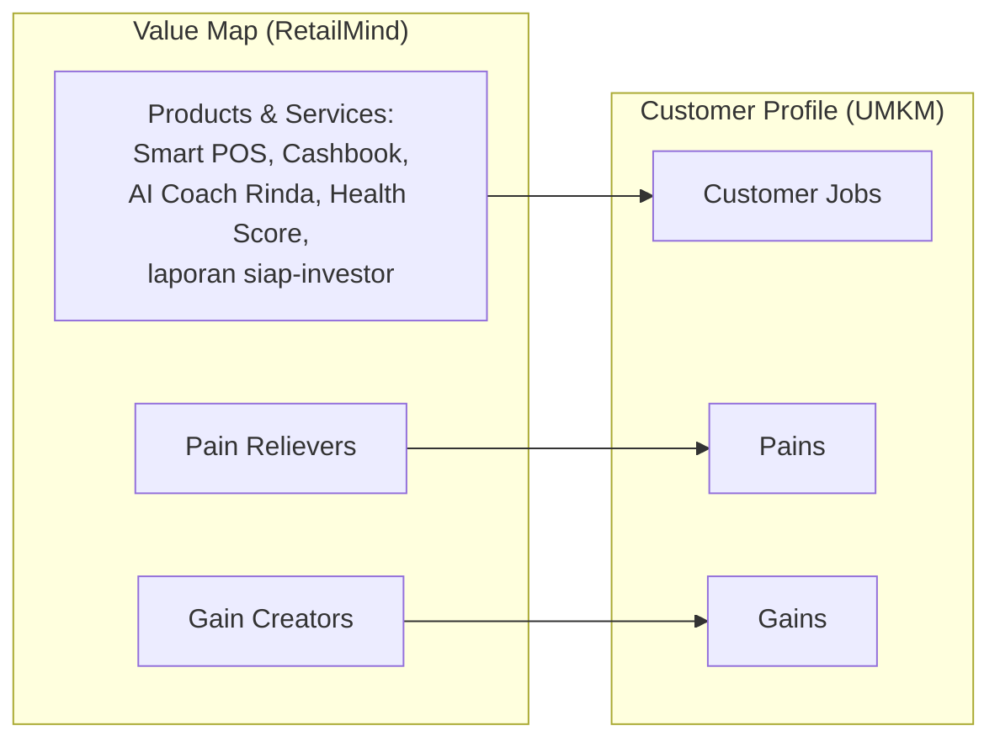
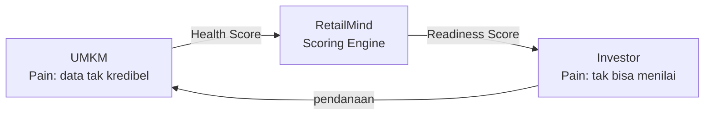

> [!abstract] Tentang dokumen ini
> Value Proposition Canvas memperbesar blok Value Proposition dari [[11a - Business Model Canvas]]. Ia mencocokkan **jobs, pains, gains** pelanggan (dari [[04a - Persona Customer & User]]) dengan **produk, pain relievers, gain creators** RetailMind. Tujuannya membuktikan bahwa yang kita bangun benar-benar menjawab yang pelanggan butuhkan (product-market fit).

> [!info] Cara membaca
> Sisi kanan (lingkaran) = profil pelanggan: apa yang mereka kerjakan, apa yang menyakitkan, apa yang diharapkan. Sisi kiri (kotak) = peta nilai kita: produk apa, bagaimana meredakan sakit, bagaimana menciptakan manfaat. Fit terjadi saat pain relievers menutup pains dan gain creators memenuhi gains.

---

## Segmen A: UMKM F&B (Mas Aldi & Bu Siti)

### Customer Profile UMKM

> [!note] Jobs (yang ingin dicapai)
> - **Fungsional:** tahu apakah bisnis sehat tanpa harus paham akuntansi.
> - **Fungsional:** menyatukan data lintas kanal (POS, GoFood, GrabFood, transfer) jadi bukti performa.
> - **Emosional:** merasa percaya diri saat bertemu investor atau lembaga pembiayaan.
> - **Sosial:** diakui sebagai pengusaha serius, bukan pedagang kecil.

> [!danger] Pains (yang menyakitkan)
> - Data terfragmentasi, tidak bisa menjawab "laba bulan lalu berapa".
> - Malu dan cemas saat diminta laporan keuangan.
> - Gagal asesmen kredit karena tidak ada dokumen kredibel.
> - Aplikasi pembukuan pernah dicoba lalu ditinggalkan karena rumit.
> - Layak didanai tetapi tidak bisa membuktikannya, terjebak skala kecil.

> [!success] Gains (yang diharapkan)
> - Laporan siap-investor tanpa kerja rekap manual.
> - Skor yang bisa diperbaiki dan ditunjukkan.
> - Visibilitas ke investor ritel.
> - Rasa percaya diri dan pengakuan.

### Value Map RetailMind untuk UMKM

| Elemen | Isi |
|---|---|
| **Products & Services** | Smart POS, Smart Cashbook (OCR nota), AI Coach Rinda, Business Health Score 0-100, laporan siap-investor |
| **Pain Relievers** | Input mudah + OCR mengurangi kerja manual; skor otomatis dari data harian; bahasa Indonesia sederhana lewat AI Coach; privasi terjaga (investor hanya lihat skor, bukan transaksi mentah) |
| **Gain Creators** | Health Score sebagai bukti kredibilitas; akses langsung ke investor; coaching actionable untuk menaikkan skor; onboarding dampingan untuk yang kurang melek digital |

> [!check] Fit
> Pain terbesar UMKM (data tidak bisa "bicara" ke investor) ditutup langsung oleh gain creator utama (Health Score kredibel + akses investor). Pain adopsi (aplikasi rumit) ditutup oleh pain reliever (input mudah + AI Coach berbahasa Indonesia).

---

## Segmen B: Investor & Lembaga (Pak Reza & Ibu Wulan)

### Customer Profile Investor

> [!note] Jobs
> - Menyaring UMKM layak danai dalam hitungan menit, bukan minggu.
> - Mengambil keputusan berbasis data, bukan firasat.
> - Memantau kesehatan portofolio secara berkala.
> - (Ritel) berkontribusi ke ekonomi lokal; (lembaga) menaikkan kapasitas & menurunkan biaya asesmen.

> [!danger] Pains
> - Asimetri informasi: tak bisa bedakan UMKM sehat vs sekadar terlihat sehat.
> - Tidak ada standar penilaian yang apple-to-apple.
> - Screening manual mahal (Rp5-15 juta) dan lambat (2-4 minggu), kapasitas 5-10 UMKM/bulan/analis.
> - Takut gagal bayar dan minim alat pemantauan pasca-pendanaan.

> [!success] Gains
> - Keputusan screening dalam menit.
> - Metrik terstandar untuk membandingkan UMKM antar-kota.
> - Deal flow yang sudah tersaring dan terverifikasi.
> - Pemantauan portofolio pasif.

### Value Map RetailMind untuk Investor

| Elemen | Isi |
|---|---|
| **Products & Services** | Investor Dashboard, Investment Readiness Score (Low/Med/High), risk indicators, portfolio monitoring, discovery filter + peta geolokasi |
| **Pain Relievers** | Readiness Score standar memangkas screening 90%+; `data_consistency_score` mengukur kepercayaan data; cross-validation POS vs Cashbook mendeteksi manipulasi; privasi & kepatuhan (lihat [[13 - Pitch & Antisipasi Juri]]) |
| **Gain Creators** | Deal flow tersaring siap dinilai; standardisasi antar-kota; monitoring pasif; risk pre-qualification otomatis via `risk_flags` |

> [!check] Fit
> Pain inti investor (asimetri informasi + screening mahal) ditutup oleh Readiness Score + data consistency score. Job "putuskan cepat berbasis data" dipenuhi gain creator (deal flow tersaring + risk flags).

---

## Ringkasan fit dua sisi

Nilai RetailMind bukan pada satu sisi, melainkan pada **menutup dua pain sekaligus dengan satu mesin skor**. Pain UMKM (tidak kredibel) dan pain investor (tidak bisa menilai) adalah dua sisi dari masalah yang sama: tidak ada data terpercaya di antara mereka.

→ Sumber persona: [[04a - Persona Customer & User]] · Model bisnis: [[11a - Business Model Canvas]] · Scoring: [[07 - Scoring Engine]] · Kembali: [[00 - Beranda (MOC)]]
