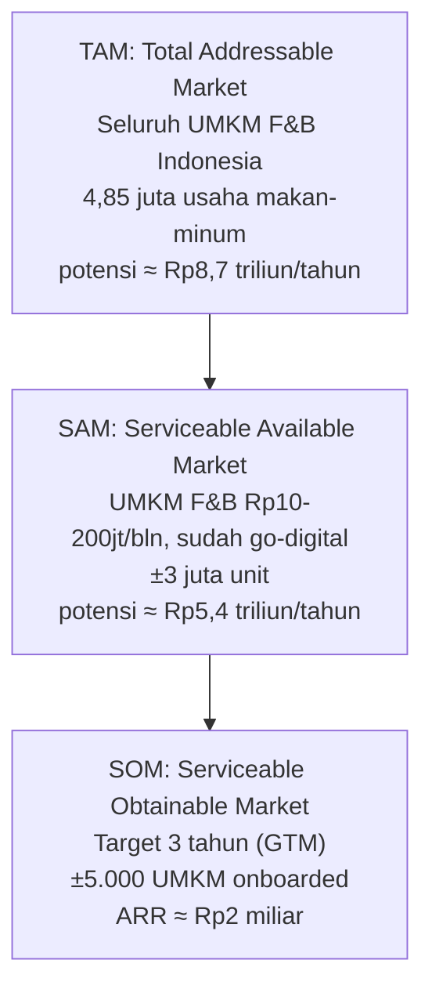

> [!abstract] Tentang dokumen ini
> Membingkai ukuran pasar RetailMind menjadi corong TAM (total), SAM (yang bisa dilayani), dan SOM (yang realistis diraih). Data mentah dari [[04 - Riset Pasar F&B Indonesia]]; harga dari [[11a - Business Model Canvas]]. Semua angka nilai pasar adalah **estimasi turunan** dan ditandai asumsinya, sejalan dengan disiplin sitasi vault.

> [!warning] Aturan main angka
> Angka jumlah usaha bersumber resmi (BPS, Kemenkop). Angka **nilai rupiah** adalah perkalian jumlah usaha dengan ARPU, jadi bersifat proyeksi, bukan kutipan. Selalu sebut sebagai "potensi nilai pasar", bukan pasar aktual.

## Corong pasar

## TAM: Total Addressable Market

**Populasi:** seluruh usaha penyediaan makan-minum di Indonesia = **4,85 juta usaha** (BPS, 2023). Ini seluruh sektor F&B yang, secara prinsip, bisa memakai RetailMind.

**Potensi nilai (langganan UMKM saja):**
- ARPU Pro = Rp149.000/bln × 12 = **Rp1.788.000/UMKM/tahun**
- TAM langganan = 4,85 juta × Rp1.788.000 ≈ **Rp8,67 triliun/tahun**

> [!note] Konteks yang memperbesar TAM
> Ini baru revenue langganan UMKM. Belum termasuk Investor Access (Rp299K/bln), API License lembaga (Rp2-5jt/bln), dan matching fee 1-2% per deal. Jika ditambahkan, TAM riil lebih besar. Untuk pitch, cukup pakai angka langganan yang konservatif dan mudah dipertanggungjawabkan.

## SAM: Serviceable Available Market

**Populasi:** UMKM F&B beromzet **Rp10-200 juta/bulan** yang sudah go-digital (punya QRIS/POS) dan relevan untuk scoring = **±3 juta unit** (batas bawah kisaran 3-5 juta di [[11 - Business Model & GTM]], dikoreksi faktor adopsi digital).

**Dasar penyaring:**
- 25,5 juta UMKM sudah go-digital dan 32 juta merchant QRIS (95% UMKM) menunjukkan infrastruktur transaksi sudah masif (BI & Kemenkop, 2024).
- Yang masuk kriteria omzet dan sektor F&B adalah subset dari itu.

**Potensi nilai:**
- SAM langganan = 3 juta × Rp1.788.000 ≈ **Rp5,36 triliun/tahun**

## SOM: Serviceable Obtainable Market

**Target realistis 3 tahun**, mengikuti tahapan go-to-market:
- Fase pilot Yogyakarta: 20-30 UMKM
- Fase multi-kota: 200-500 UMKM
- Fase nasional (>24 bulan): 5.000+ UMKM

Ambil **±5.000 UMKM onboarded** sebagai target akhir tahun ke-3.

**Potensi ARR (base-case, dengan asumsi konversi):**
- Asumsi konversi Free ke Pro ~20% → 1.000 UMKM Pro × Rp1.788.000 ≈ **Rp1,79 miliar/tahun**
- Tambahan Investor Access + API License lembaga → total ARR ≈ **Rp2 miliar/tahun** (rincian di [[11b - Proyeksi Finansial 3 Tahun]])

> [!info] SOM = ambisi yang bisa dieksekusi
> SOM sengaja jauh lebih kecil dari SAM. Ini menunjukkan ke juri bahwa kita realistis: bukan mengklaim menguasai Rp5 triliun, tetapi menargetkan pijakan awal ~0,17% dari SAM dalam 3 tahun, dengan ruang tumbuh besar setelahnya.

## Kenapa angka ini kredibel untuk pitch

| Klaim | Landasan |
|---|---|
| Pasar besar & nyata | 4,85 juta usaha F&B, kuliner 41-43% PDB ekraf (BPS, Databoks) |
| Masalah terukur | financing gap ≈ Rp2.400T / USD 234 miliar (Kemenko, IFC) |
| Infrastruktur siap | 32 juta merchant QRIS, 25,5 juta go-digital (BI, Kemenkop) |
| Target realistis | SOM 5.000 UMKM = eksekusi bertahap, bukan klaim dominasi |

Sumber angka populasi & pasar: [[04 - Riset Pasar F&B Indonesia]].

→ Proyeksi rupiah bertahun: [[11b - Proyeksi Finansial 3 Tahun]] · Model bisnis: [[11a - Business Model Canvas]] · Kembali: [[00 - Beranda (MOC)]]
