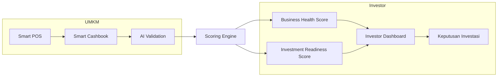

> [!abstract] Positioning
> RetailMind AI adalah **Business Health Scoring Platform** untuk UMKM F&B Indonesia. **Kami tidak bersaing dengan software POS** — kami memakai data operasional UMKM untuk menghasilkan skor kesehatan bisnis yang dipercaya investor, koperasi, BPR, fintech, dan bank.

## Positioning Statement
Untuk UMKM F&B yang frustrasi karena datanya tidak bisa "bicara" kepada investor, RetailMind AI adalah platform **pertama di Indonesia yang mengintegrasikan tiga layer dalam satu produk vertikal F&B** — operasional (POS + Cashbook), scoring kesehatan bisnis, dan marketplace investor — sehingga bisnis yang sudah bekerja keras akhirnya dapat diakui dan didanai.

## Value Proposition Dua Sisi

> [!success] Untuk UMKM
> - Business Health Score 0–100 berbasis data nyata (bukan generik)
> - AI Coach **Rinda**: insight actionable Bahasa Indonesia, real-time
> - Laporan siap investor dalam 1 klik
> - Visibilitas ke investor ritel

> [!success] Untuk Investor
> - Screening UMKM dalam menit (vs 2–4 minggu manual)
> - Investment Readiness Score: Low / Medium / High
> - Risk indicators & tren 90 hari otomatis
> - Portfolio monitoring terpusat

## Alur Dua Sisi (UMKM ↔ Investor)

## Key Innovation

> [!tip] Data Flywheel
> RetailMind bukan sekadar pencatatan. Setiap transaksi yang tercatat **meningkatkan kualitas penilaian bisnis.** Semakin lama UMKM memakai platform, semakin tinggi kepercayaan data yang dihasilkan → makin kuat *moat*-nya. Lihat [[08 - Keunggulan & Diferensiasi]].

## Modul Inti

1. [[06 - Modul Produk]] — Smart POS, Smart Cashbook, AI Business Coach, Investor Dashboard
2. [[07 - Scoring Engine]] — Business Health Score & Investment Readiness Score

→ Masalah yang dijawab: [[02 - Masalah UMKM F&B]] · [[03 - Kebutuhan & Peran Investor]]
→ Kembali: [[00 - Beranda (MOC)]]
