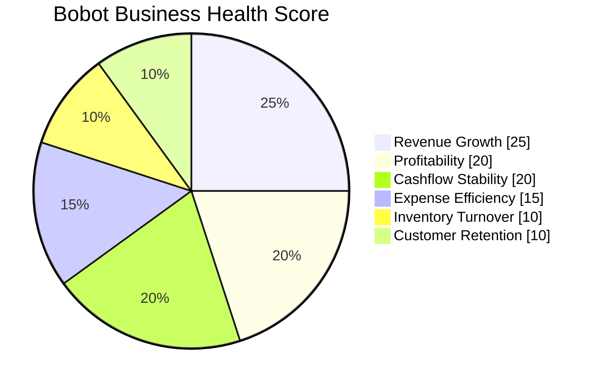
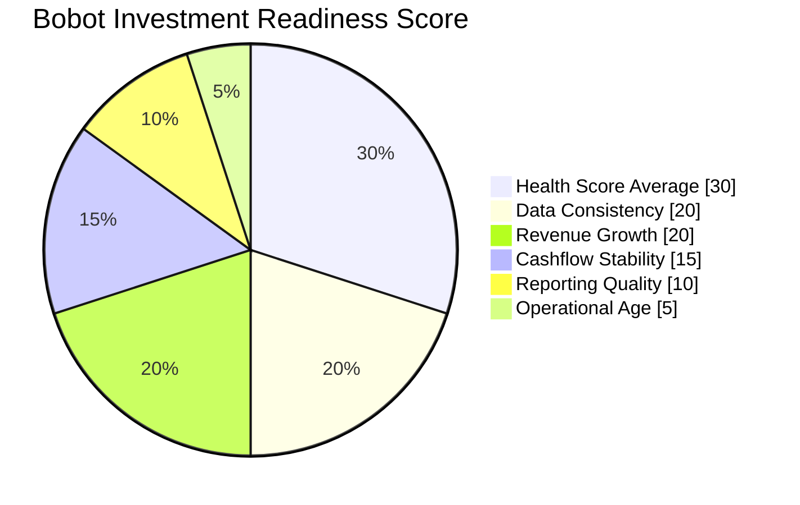

> [!abstract] Inti inovasi
> RetailMind menciptakan **standar penilaian kesehatan bisnis UMKM** berbasis data operasional nyata: dua skor terstandar (0–100) yang bisa dibandingkan antar-UMKM.

## A. Business Health Score (0–100)

Mengukur kesehatan bisnis dari 6 komponen tertimbang. Sumber: `lib/scoring/health-score.ts`.

| Komponen | Bobot | Metrik |
|---|---|---|
| Revenue Growth | 25% | Perubahan omzet vs rata-rata 3 bulan |
| Profitability | 20% | Blend gross margin (0.6) + net margin (0.4) |
| Cashflow Stability | 20% | Koefisien variasi arus kas harian |
| Expense Efficiency | 15% | Rasio pengeluaran terhadap omzet |
| Inventory Turnover | 10% | Hari stok beredar |
| Customer Retention | 10% | Tingkat pelanggan kembali |

### Score Bands

| Rentang | Status | Arti |
|---|---|---|
| 🟢 80–100 | **Bisnis Sehat** | Berjalan sangat baik |
| 🔵 60–79 | **Bisnis Berkembang** | Tumbuh, ada ruang perbaikan |
| 🟡 40–59 | **Perlu Perhatian** | Aspek kritis harus diperbaiki |
| 🔴 0–39 | **Bisnis Kritis** | Tindakan segera diperlukan |

**Output:** total skor + band + daftar *insights*.

## B. Investment Readiness Score (0–100)

Mengukur kesiapan UMKM mendapat investasi/pembiayaan. Sumber: `lib/scoring/investment-readiness.ts`.

| Komponen | Bobot | Apa yang dinilai |
|---|---|---|
| Health Score Average | 30% | Rata-rata kesehatan bisnis |
| Data Consistency | 20% | Konsistensi data lintas waktu (anti-manipulasi) |
| Revenue Growth | 20% | Pertumbuhan omzet |
| Cashflow Stability | 15% | Stabilitas arus kas |
| Reporting Quality | 10% | Kualitas & kelengkapan pelaporan |
| Operational Age | 5% | Umur usaha / track record |

**Output:** skor + **level (High / Medium / Low)** + `riskFlags` + `strengths` + ringkasan.
**API:** `POST /api/scores/calculate`.

> [!note] Bukan double-counting
> "Health Score Average (30%)" memakai Business Health Score sebagai **salah satu input** Readiness. Komponen lain (Data Consistency 20%, Reporting Quality 10%, Operational Age 5%, ditambah Revenue Growth & Cashflow yang ditimbang ulang untuk lensa investor) menilai **kesiapan investasi & kepercayaan data** — hal yang TIDAK ada di Health Score. Jadi: Readiness = kesehatan bisnis (30%) + kualitas/kesiapan data bagi investor (70%).

## Guardrail Kualitas Data

> [!warning] Anti "garbage in, garbage out"
> - Insight & skor hanya dihasilkan jika **data completeness ≥ 60%**.
> - `data_consistency_score` & `reporting_quality_score` secara eksplisit mengukur **seberapa bisa data dipercaya** — bukan hanya nilainya, tapi kualitasnya.
> - Inilah pembeda dari laporan keuangan manual yang mudah direkayasa (lihat [[03 - Kebutuhan & Peran Investor]]).

## Hubungan dengan Due Diligence

Setiap kriteria yang dilihat investor (5C, kolektibilitas OJK) dipetakan ke komponen skor di atas. Health Score tinggi & stabil = proksi prediktif **Kol-1 (Lancar)**. Tabel pemetaan lengkap: [[03 - Kebutuhan & Peran Investor]].

→ Diferensiasi: [[08 - Keunggulan & Diferensiasi]] · Visual & contoh data: [[10 - Data, Demo & Visualisasi]] · Kembali: [[00 - Beranda (MOC)]]
