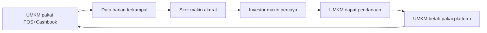

> [!abstract] Satu kalimat
> Kompetitor berhenti di **laporan**. RetailMind menghasilkan **keputusan investasi.**

## Mengapa bukan sekadar POS

POS biasa (Moka, Majoo) dan software akuntansi (Jurnal.id) hanya **mencatat**. RetailMind memakai catatan itu untuk **menilai & menjembatani** UMKM dengan investor. Kami bukan pesaing POS — kami lapisan kecerdasan di atasnya.

## Tabel Kompetitor

| Fitur                           | **RetailMind AI** |  Moka POS  |   Majoo    | Jurnal.id  | Spreadsheet |
| ------------------------------- | :---------------: | :--------: | :--------: | :--------: | :---------: |
| Pencatatan transaksi            |         ✅         |     ✅      |     ✅      |     ✅      |      ✅      |
| Laporan keuangan                |         ✅         |     ✅      |     ✅      |     ✅      |   Manual    |
| **Business Health Score 0–100** |         ✅         |     ❌      |     ❌      |  Parsial   |      ❌      |
| **AI Business Coach**           |         ✅         |     ❌      |     ❌      |     ❌      |      ❌      |
| **Investor Dashboard**          |         ✅         |     ❌      |     ❌      |     ❌      |      ❌      |
| **Investment Readiness Score**  |         ✅         |     ❌      |     ❌      |     ❌      |      ❌      |
| Khusus F&B Indonesia            |         ✅         |  Parsial   |  Parsial   |     ❌      |      ❌      |
| AI-powered scoring              |         ✅         |     ❌      |     ❌      |     ❌      |      ❌      |
| Harga mulai                     |    **Gratis**     | Rp149K/bln | Rp149K/bln | Rp199K/bln |   Gratis    |

> [!note] Selain POS, ada pemain credit-scoring / fintech
> Platform seperti **CredoLab, Modalku/Akseleran**, atau penyedia *Innovative Credit Scoring* menilai kredit dari data alternatif — tetapi di **sisi lender**. Pembeda RetailMind: menggabungkan **pencatatan operasional UMKM + scoring + marketplace investor** dalam satu produk **vertikal F&B**, dimiliki oleh UMKM-nya sendiri (first-party data), bukan sekadar mesin skor untuk pemberi pinjaman.

## Unfair Advantage / Moat

1. **Data Flywheel** — makin lama dipakai, makin akurat skor, makin sulit ditiru.
2. **Scoring model khusus F&B Indonesia** — bukan model generik luar negeri.
3. **Integrasi tiga layer** — satu-satunya yang menyatukan **operasional UMKM + scoring + marketplace investor** dalam satu produk vertikal F&B (pemain lain hanya scoring di sisi lender, atau hanya pencatatan).
4. **Tim AI/ML UGM** + riset lapangan 15 UMKM F&B Yogyakarta.

## Product Thesis

> [!quote]
> Investor tidak kekurangan UMKM — mereka kekurangan **data yang dapat dipercaya.**
> UMKM tidak kekurangan modal — mereka kekurangan **kredibilitas yang dapat dibuktikan.**
> **RetailMind AI menjadi jembatan di antara keduanya.**

→ Scoring: [[07 - Scoring Engine]] · Model bisnis: [[11 - Business Model & GTM]] · Kembali: [[00 - Beranda (MOC)]]
