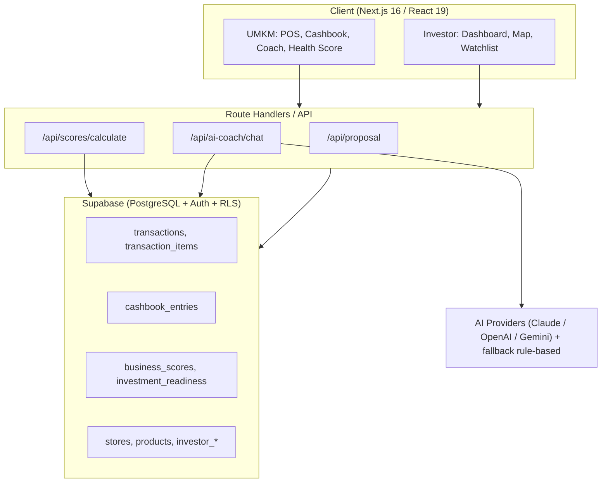

> [!summary] Stack modern, terbukti production
> Next.js 16 + React 19 + Supabase + AI multi-provider. Keamanan via Row Level Security (RLS).

## Tech Stack (aktual MVP)

| Layer | Teknologi |
|---|---|
| Frontend | Next.js 16.2.7 (App Router) + React 19 + TypeScript |
| Styling | Tailwind CSS v4 + shadcn/ui + Lucide icons |
| Backend / Data | Supabase (PostgreSQL + Auth + RLS, SSR) |
| AI Engine | Multi-provider: Anthropic Claude · OpenAI · Google Gemini — dengan **fallback rule-based** |
| Charts | Recharts 3.8.1 |
| Lain | @react-pdf/renderer (export PDF), Leaflet (map), Zustand (state), React Query, PapaParse (CSV) |

> [!note] Catatan provider AI
> Codebase memuat SDK Anthropic, OpenAI, dan Gemini sekaligus, plus fallback `rule-based-responses.ts` agar demo tetap jalan tanpa kuota AI. Proposal v2 menyebut Claude sebagai engine utama — perlu disamakan, lihat [[16 - Perbaikan Proposal]].

## Diagram Arsitektur

## Algoritma & AI

- **Hybrid scoring** — model berbobot 6 komponen dengan guardrail validasi data (≥60% completeness).
- **RAG-based Coach (Rinda)** — konteks data bisnis nyata per toko, bukan pengetahuan generik.
- **Multi-tenant** — isolasi data per UMKM.

## Keamanan & Privasi

| Layer | Mekanisme |
|---|---|
| Isolasi data | Row Level Security (RLS) per UMKM |
| Akses investor | Hanya skor & ringkasan — **tidak ada akses transaksi mentah/cashbook** |
| Compliance | Selaras POJK keamanan data fintech P2P |
| Audit trail | Setiap akses data dilog |

> [!important] Detail keamanan & compliance untuk Tahap 2 ada di [[17 - Pertanyaan & Jawaban Tahap 2]] (Security & Compliance).

→ Modul: [[06 - Modul Produk]] · Data: [[10 - Data, Demo & Visualisasi]] · Kembali: [[00 - Beranda (MOC)]]
