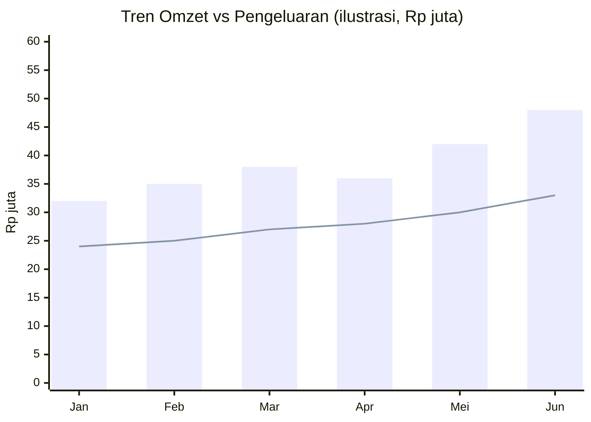

> [!summary] Cara membuktikan ke juri
> Data nyata → skor → keputusan investor, live. Akun demo & data F&B Yogyakarta sudah ter-seed.

## Akun Demo

| Peran    | Email               | Password     |
| -------- | ------------------- | ------------ |
| UMKM     | `umkm@demo.com`     | `demo123456` |
| Investor | `investor@demo.com` | `demo123456` |

## Data Sample (sesuai codebase)

> [!note] Sumber kebenaran = seed di codebase
> Data berikut diverifikasi dari `supabase/migrations/006_seed_demo_data.sql` & `008_seed_more_umkm.sql`.

**Akun UMKM →** "Warung Makan Bu Siti" (F&B): 5 produk (Kopi, Nasi Goreng, Teh, Mie, Es Campur), ~75 transaksi selama 90 hari.

**Akun Investor →** 10 UMKM F&B Yogyakarta untuk screening, Health Score 49–86, dengan geolokasi (map):

| UMKM | Kategori |
|---|---|
| Kopi Senja Jogja | Cafe |
| Bakmi Jawa Pak Pele | Warung makan |
| Roti Bakar Malioboro | Bakery |
| Es Teler Sleman Segar | Minuman |
| Ayam Geprek Bu Rini | Restoran |
| Catering Berkah Boga | Catering |
| Angkringan Kota Gede | Street food |
| Sate Klathak Pak Bari | Restoran |
| Gudeg Yu Djum Cabang | Restoran |
| Kedai Susu Murni Pakem | Minuman |

> [!warning] Perlu disamakan dengan proposal
> Proposal v2 menyebut demo store berbeda (Warung Nasi Bu Sari · Kopi Kekinian Mas Budi · Catering Pak Hendra). **Data live ≠ narasi proposal.** Samakan sebelum demo — lihat [[16 - Perbaikan Proposal]].

## Visualisasi (Recharts)

### Dashboard
- **RevenueChart** — ComposedChart: Revenue (bar) + Expenses (bar) + Growth % (line), toggle 3/6/12 bulan, dual Y-axis, badge proyeksi.

### Cashbook (5 chart)
1. Income vs Expense (6 bulan) — ComposedChart
2. Daily Net Cashflow (14 hari) — AreaChart
3. Expense by Category (Top 6) — BarChart horizontal
4. Debt & Receivable (bulanan) — BarChart
5. Month-over-Month Net Flow — BarChart (warna +/-)

### Contoh Revenue Trend (ilustrasi)

> [!tip] Skenario demo 90 detik
> 1. Login UMKM → tunjukkan POS + Cashbook → data harian masuk.
> 2. Buka Health Score → skor + insight AI Coach Rinda.
> 3. Login Investor → dashboard 10 UMKM → filter skor → buka detail → Risk Flags → keputusan.

→ Teknologi: [[09 - Arsitektur & Teknologi]] · Scoring: [[07 - Scoring Engine]] · Kembali: [[00 - Beranda (MOC)]]
