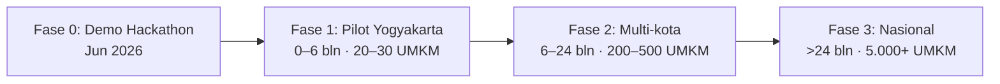

> [!summary]
> Freemium dua sisi: UMKM masuk gratis (akuisisi & data), monetisasi via Pro, akses investor, lisensi API, dan matching fee.

## Revenue Streams

| Tier | Harga | Keterangan |
|---|---|---|
| Free (UMKM) | Rp 0 | Akuisisi & data collection |
| **Pro (UMKM)** | Rp 149.000/bln | Revenue stream utama |
| Investor Access | Rp 299.000/bln | Secondary revenue |
| API License (B2B) | Rp 2–5 juta/bln | Enterprise lembaga pembiayaan |
| Matching Fee | 1–2% per deal | Monetisasi jangka panjang |

## Cost Structure

| Item | Porsi |
|---|---|
| Engineering & AI development | 60% |
| AI API costs (Claude/OCR) | 20% |
| Marketing & akuisisi | 15% |
| Operations & infrastruktur | 5% |

## Customer Segments

- **Primary:** UMKM F&B Rp10–200 juta/bulan (warung, kafe, bakery, catering) — diperkirakan **3–5 juta unit usaha** (BPS & Kemenkop, 2024).
- **Secondary:** Investor ritel, BPR, Koperasi, Fintech P2P.

## Unit Economics

| Metrik | Estimasi |
|---|---|
| CAC UMKM (via komunitas) | Rp 50.000–150.000 |
| LTV UMKM Pro (12 bulan) | Rp 1.788.000 |
| **LTV / CAC** | **12–36×** |
| Payback period | < 1 bulan |

> [!note] Asumsi (base-case)
> LTV Pro Rp1.788.000 = Rp149K × ~12 bulan retensi (asumsi churn bulanan ~8%). Rentang **LTV/CAC 12–36×** berasal dari CAC Rp150K (konservatif) hingga Rp50K (optimis via komunitas). Angka final akan divalidasi saat pilot — gunakan **base-case ~12×** dalam pitch agar tidak dianggap overclaim.

## Go-To-Market

| Fase | Target | Channel / Partnership |
|---|---|---|
| Pilot Yogyakarta | 20–30 UMKM, 1.000+ transaksi | WhatsApp komunitas, Instagram UMKM lokal |
| Multi-kota | 200–500 UMKM, Rp50–200jt ARR | BPR, Koperasi, Fintech P2P |
| Nasional | 5.000+ UMKM, integrasi GoFood/GrabFood | RetailMind Score jadi standar evaluasi |

## Channels
Direct (Website + PWA) · Community (WhatsApp UMKM, Instagram) · B2B (fintech & koperasi) · Events (bazar UMKM).

→ Keunggulan: [[08 - Keunggulan & Diferensiasi]] · Roadmap & metrik: [[12 - Roadmap & Metrik Sukses]] · Kembali: [[00 - Beranda (MOC)]]
