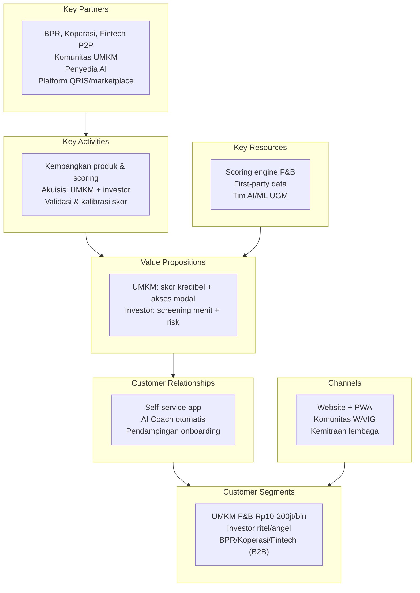

> [!abstract] Tentang dokumen ini
> Business Model Canvas (9 blok, kerangka Osterwalder) untuk RetailMind AI. Ini dokumen strategi, bukan slide. Isinya menyuplai slide business model dan menjadi rujukan saat sesi tanya jawab juri. Angka dan detail bersumber dari [[11 - Business Model & GTM]], [[08 - Keunggulan & Diferensiasi]], dan [[04a - Persona Customer & User]].

## Peta ringkas

## 1. Customer Segments (untuk siapa)

Dua sisi pasar. Pemisahan customer dan user detail di [[04a - Persona Customer & User]].

- **Primer, sisi UMKM:** UMKM F&B beromzet Rp10-200 juta/bulan (warung makan, kedai kopi/minuman, bakery, catering). Estimasi 3-5 juta unit usaha (BPS & Kemenkop, 2024).
- **Sekunder, sisi investor (individu):** investor ritel dan angel lokal yang mencari imbal hasil sekaligus dampak.
- **Sekunder, sisi lembaga (B2B):** BPR, koperasi, dan fintech P2P yang butuh deal flow UMKM tersaring.

## 2. Value Propositions (nilai yang ditawarkan)

> [!success] Untuk UMKM
> Business Health Score 0-100 berbasis data nyata, AI Coach Rinda berbahasa Indonesia, laporan siap-investor satu klik, dan visibilitas ke investor. Intinya: mengubah kerja keras harian menjadi kredibilitas yang bisa dibuktikan.

> [!success] Untuk Investor & Lembaga
> Screening UMKM dalam menit (bukan 2-4 minggu), Investment Readiness Score Low/Medium/High, risk indicators dan tren 90 hari, portfolio monitoring terpusat, serta standardisasi metrik antar-kota.

Pernyataan tesis: investor tidak kekurangan UMKM, mereka kekurangan data terpercaya; UMKM tidak kekurangan modal, mereka kekurangan kredibilitas yang bisa dibuktikan. RetailMind jembatannya (lihat [[08 - Keunggulan & Diferensiasi]]).

## 3. Channels (cara menjangkau)

- **Direct:** Website dan PWA (akuisisi UMKM & investor mandiri).
- **Community:** grup WhatsApp UMKM dan Instagram UMKM lokal (biaya akuisisi rendah).
- **B2B / Partnership:** BPR, koperasi, dan fintech P2P sebagai penyalur dan pembeli lisensi.
- **Events:** bazar dan komunitas UMKM untuk demo dan onboarding.

## 4. Customer Relationships (cara menjaga hubungan)

- **Self-service:** aplikasi dipakai mandiri oleh UMKM dan investor.
- **Otomatis:** AI Coach Rinda melakukan business check-in berkala.
- **Pendampingan:** onboarding berbantuan komunitas untuk persona yang butuh edukasi (lihat P1 di [[04a - Persona Customer & User]]).
- **Retensi via Data Flywheel:** makin lama dipakai, makin akurat skor, makin sulit ditinggalkan (lihat [[08 - Keunggulan & Diferensiasi]]).

## 5. Revenue Streams (dari mana uang masuk)

| Sumber | Harga | Peran |
|---|---|---|
| Free (UMKM) | Rp 0 | Akuisisi & pengumpulan data |
| **Pro (UMKM)** | Rp 149.000/bln | Revenue utama |
| Investor Access | Rp 299.000/bln | Revenue sekunder |
| API License (B2B) | Rp 2-5 juta/bln | Enterprise lembaga pembiayaan |
| Matching Fee | 1-2% per deal | Monetisasi jangka panjang |

Detail unit economics: [[11b - Proyeksi Finansial 3 Tahun]] dan [[11 - Business Model & GTM]].

## 6. Key Resources (aset kunci)

- **Scoring engine khusus F&B Indonesia** (bukan model generik luar negeri).
- **First-party transaction data** milik UMKM sendiri (bahan bakar skor & moat).
- **Tim AI/ML UGM** plus riset lapangan 15 UMKM F&B Yogyakarta.
- **Platform teknis:** Next.js, Supabase, Claude, Recharts, RLS (lihat [[09 - Arsitektur & Teknologi]]).

## 7. Key Activities (kegiatan inti)

- Pengembangan produk dan model scoring (6 modul aktif).
- Validasi dan kalibrasi skor lewat backtest dan pilot 90 hari.
- Akuisisi dua sisi: UMKM dan investor/lembaga.
- Membangun kemitraan lembaga pembiayaan dan komunitas.

## 8. Key Partnerships (mitra kunci)

- **Lembaga pembiayaan berizin:** BPR, koperasi, fintech P2P (penyalur dana + pembeli API).
- **Komunitas UMKM:** kanal akuisisi murah dan tepercaya.
- **Penyedia AI:** Claude/OCR untuk analisis dan ekstraksi nota.
- **Regulator (selaras, bukan mitra formal):** arah Innovative Credit Scoring OJK dan agenda inklusi keuangan BI.
- **Platform transaksi (rencana):** GoFood, GrabFood, ekosistem QRIS untuk integrasi data.

## 9. Cost Structure (struktur biaya)

| Item | Porsi |
|---|---|
| Engineering & AI development | 60% |
| AI API costs (Claude/OCR) | 20% |
| Marketing & akuisisi | 15% |
| Operations & infrastruktur | 5% |

Model biaya condong ke pengembangan produk (bukan operasional berat), sehingga skalabel begitu produk matang.

## Catatan pemakaian saat pitch

> [!tip]
> Jangan tempel kanvas ini utuh sebagai satu slide. Pakai isinya untuk slide business model (blok 2, 5, 9) dan siapkan kanvas penuh sebagai lampiran atau bahan jawaban juri. Value proposition per segmen diperdalam di [[04b - Value Proposition Canvas]].

→ Terkait: [[11 - Business Model & GTM]] · [[11b - Proyeksi Finansial 3 Tahun]] · [[04b - Value Proposition Canvas]] · Kembali: [[00 - Beranda (MOC)]]
