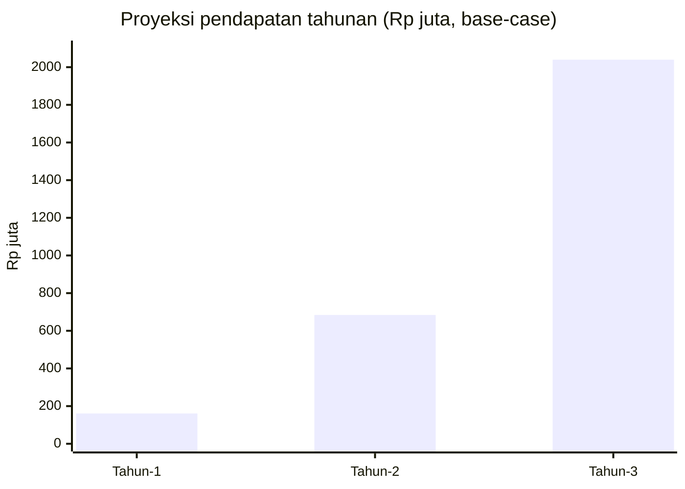

> [!abstract] Tentang dokumen ini
> Proyeksi finansial sederhana 3 tahun sebagai bahan slide "Financials". Dibangun dari unit economics dan tahapan GTM di [[11 - Business Model & GTM]] serta target SOM di [[04c - TAM SAM SOM]]. Semua angka **base-case, akan divalidasi saat pilot**. Tujuannya menunjukkan logika pertumbuhan yang masuk akal, bukan janji presisi.

> [!warning] Disiplin angka
> Ini proyeksi, bukan realisasi. Gunakan sebagai ilustrasi keberlanjutan model. Jangan diklaim sebagai angka pasti di depan juri.

## Asumsi dasar

| Parameter | Nilai | Sumber |
|---|---|---|
| Harga Pro (UMKM) | Rp 149.000/bln = Rp 1.788.000/thn | [[11 - Business Model & GTM]] |
| Harga Investor Access | Rp 299.000/bln = Rp 3.588.000/thn | [[11 - Business Model & GTM]] |
| Harga API License (B2B) | Rp 3.500.000/bln = Rp 42.000.000/thn (titik tengah 2-5jt) | [[11 - Business Model & GTM]] |
| Konversi Free ke Pro | ~25% dari UMKM onboarded | asumsi base-case |
| Churn Pro bulanan | ~8% | [[11 - Business Model & GTM]] |
| CAC UMKM (via komunitas) | Rp 50.000-150.000 | [[11 - Business Model & GTM]] |

## Proyeksi pertumbuhan pengguna

| Metrik | Tahun 1 | Tahun 2 | Tahun 3 |
|---|---|---|---|
| UMKM onboarded (kumulatif) | 200 | 700 | 2.000 |
| UMKM Pro aktif (~25%) | 50 | 175 | 500 |
| Investor Access aktif | 20 | 80 | 250 |
| Klien API B2B (BPR/Koperasi) | 0 | 2 | 6 |

> [!note] Kaitan dengan GTM
> Tahun 1 menutup fase pilot dan awal multi-kota (20-30 lalu tumbuh ke 200). Tahun 2-3 fase multi-kota penuh menuju nasional. Angka 5.000+ UMKM dari roadmap adalah target >24-36 bulan, jadi 2.000 di akhir Tahun 3 adalah jalur konservatif.

## Proyeksi pendapatan (Rp)

| Sumber | Tahun 1 | Tahun 2 | Tahun 3 |
|---|---|---|---|
| Pro UMKM | 89,4 jt | 312,9 jt | 894 jt |
| Investor Access | 71,8 jt | 287 jt | 897 jt |
| API License B2B | 0 | 84 jt | 252 jt |
| **Total pendapatan** | **≈ 161 jt** | **≈ 684 jt** | **≈ 2,04 miliar** |

Matching fee (1-2% per deal) sengaja **tidak** dimasukkan ke base-case. Ia menjadi upside begitu volume pendanaan terbentuk.

## Logika biaya & jalan menuju sehat

Struktur biaya condong ke pengembangan produk, bukan operasional berat (lihat [[11a - Business Model Canvas]]):

| Item | Porsi | Sifat |
|---|---|---|
| Engineering & AI development | 60% | Investasi awal, menurun relatif saat skala |
| AI API (Claude/OCR) | 20% | Variabel, mengikuti volume transaksi |
| Marketing & akuisisi | 15% | CAC rendah via komunitas (Rp50-150K) |
| Operations & infrastruktur | 5% | Rendah, model SaaS |

> [!success] Kenapa modelnya menarik
> - **LTV/CAC 12-36×** (base-case ~12×), payback < 1 bulan.
> - Biaya dominan (engineering) bersifat sekali-bangun lalu dipakai banyak pengguna, sehingga margin membaik seiring skala.
> - Dua sisi revenue (UMKM + investor) plus B2B API mengurangi ketergantungan pada satu sumber.

## Kebutuhan pendanaan (kaitkan ke The Ask)

Pendapatan Tahun 1 (~Rp161 juta) belum menutup investasi pengembangan awal, sehingga pilot butuh dukungan modal. Rincian permintaan ada di [[20 - One-Pager & The Ask]].

> [!note] Sanity check
> Angka ini konsisten dengan target [[12 - Roadmap & Metrik Sukses]] (200-500 UMKM di 6-24 bulan) dan SOM di [[04c - TAM SAM SOM]] (±5.000 UMKM, ARR ~Rp2 miliar di jalur 3 tahun awal). Bukan hockey-stick berlebihan.

→ Model bisnis: [[11 - Business Model & GTM]] · Kanvas: [[11a - Business Model Canvas]] · Pasar: [[04c - TAM SAM SOM]] · Kembali: [[00 - Beranda (MOC)]]
