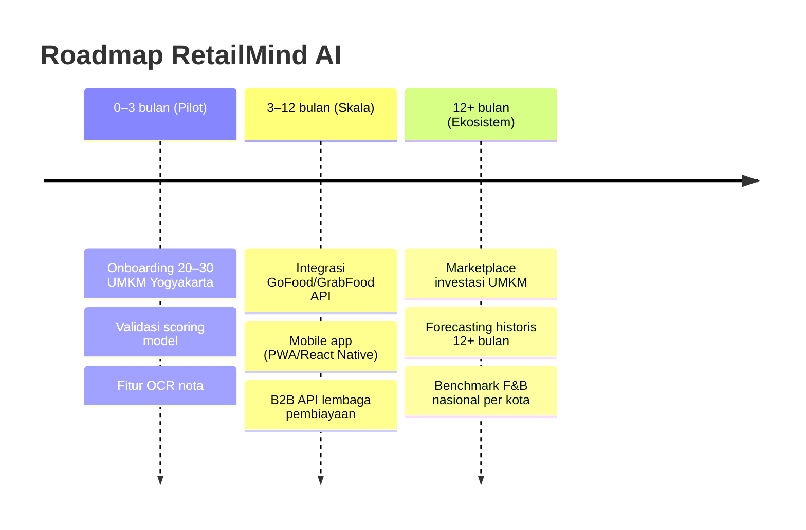

> [!summary]
> Dari Working Prototype → Pilot Yogyakarta → ekosistem nasional, dengan KPI terukur tiap fase.

## Roadmap Produk

## Target Dampak Terukur

| Periode | Target |
|---|---|
| **0–6 bulan** | 20–30 UMKM onboarded · kelengkapan data <40% → >75% · 1.000+ transaksi · first investor assessment |
| **6–24 bulan** | 200–500 UMKM · 100+ investor assessments · integrasi BPR/Koperasi |
| **>24 bulan** | RetailMind Score jadi standar evaluasi UMKM yang diakui nasional |

## KPI Utama

| KPI | Definisi |
|---|---|
| UMKM onboarded / bulan | Akuisisi sisi UMKM |
| Transaksi tercatat / bulan | Volume data (bahan bakar skor) |
| Scores generated | Skor kesehatan & readiness yang dihasilkan |
| Investor assessments | Screening yang diselesaikan investor |
| Konversi Free → Pro | Monetisasi |
| Kelengkapan data | % UMKM dengan data ≥75% |

## Dampak untuk Ekosistem

> [!success] Selaras agenda nasional
> - Kontribusi langsung ke **agenda inklusi keuangan Bank Indonesia**.
> - Mendukung target OJK: UMKM dengan laporan keuangan formal dari **19% → 50% (2030)**.
> - Mengurangi biaya due diligence investor hingga **80%**; screening 50+ UMKM dalam sehari.
> - Data benchmark F&B nasional untuk kebijakan pembiayaan.

→ GTM: [[11 - Business Model & GTM]] · Pitch: [[13 - Pitch & Antisipasi Juri]] · Kembali: [[00 - Beranda (MOC)]]

> [!note] Dasar estimasi "−80%"
> Due diligence konvensional UMKM ≈ **Rp5–15 juta & 2–4 minggu** per UMKM (1 analis hanya 5–10 UMKM/bulan). Screening berbasis skor memangkas drastis waktu & biaya ini. Angka −80% adalah **proyeksi** dari baseline tersebut, akan divalidasi pada pilot.
