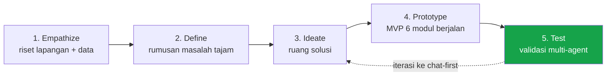

> [!abstract] Tujuan dokumen
> Memetakan proses Design Thinking (kerangka lima tahap d.school Stanford) ke perjalanan pengembangan RetailMind, dari empati awal di lapangan sampai pengujian. Dokumen ini menjelaskan bahwa tim sudah berada di tahap **Test**, dan pada tahap itulah metode validasi multi-agent ([[03 - Metode Validasi Multi-Agent]]) dipakai sebagai pengganti sementara uji lapangan. Nama brand "RetailMind" bersifat sementara.

## Posisi tim saat ini

Tim sudah menuntaskan Empathize sampai Prototype. Tahap Test sedang berjalan lewat validasi sintetis, dan temuannya sudah memicu satu iterasi arah produk menuju model chat-first hibrida ([[06 - Analisis Aplikasi & Arah WhatsApp]]).

---

## 1. Empathize

**Siapa yang diamati:** pemilik UMKM F&B (warung makan, kedai kopi, restoran, catering) dan sisi penyedia modal (investor ritel, analis kredit lembaga).

**Sumber empati:**

- Riset lapangan awal 2025 ke 15 UMKM F&B Yogyakarta (warung makan, kafe kecil, bakery rumahan).
- Data sekunder bersitasi tentang pasar, literasi keuangan, dan celah pembiayaan ([[04 - Riset Pasar F&B Indonesia]]).
- Lima persona konkret yang menjadi wajah manusia dari data ([[04a - Persona Customer & User]]).

> [!quote] Temuan emosional inti
> Hampir semua UMKM sudah memakai aplikasi kasir digital. Tetapi ketika ditanya "berapa keuntungan bersih bulan lalu?", tidak ada yang bisa menjawab dengan pasti.
>
> **Data ada. Kepercayaan tidak ada.** Inilah inti empati yang menggerakkan seluruh produk.

Rasa yang muncul di sisi UMKM adalah malu dan cemas saat diminta laporan keuangan, dan merasa usahanya serius tetapi tidak punya bukti. Di sisi investor, rasa yang muncul adalah ragu karena tidak bisa membedakan usaha yang benar-benar sehat dari yang sekadar terlihat sehat.

---

## 2. Define

Empati diringkas menjadi dua pernyataan sudut pandang (*point of view*) yang tajam.

> [!note] POV UMKM
> **Pemilik UMKM F&B** butuh cara membuktikan performa usahanya kepada investor, **tetapi** datanya terfragmentasi antar kanal dan tidak terstruktur, **sehingga** peluang pendanaan hilang bukan karena bisnisnya lemah, melainkan karena datanya tidak dipercaya.

> [!note] POV Investor
> **Investor ritel dan analis kredit** butuh menyaring UMKM layak danai secara cepat dan seragam, **tetapi** tidak ada standar penilaian objektif dan biaya asesmen manual tinggi, **sehingga** modal yang tersedia tidak sampai ke usaha yang sebenarnya layak.

Masalah yang dipilih bukan "UMKM belum digital", karena mayoritas target sudah memakai QRIS dan pencatatan digital. Masalah sebenarnya adalah **data readiness**: data ada tetapi tidak bisa berbicara sebagai bukti performa.

---

## 3. Ideate

Ruang solusi yang dieksplorasi dan keputusannya:

| Ide                             | Keputusan              | Alasan                                                                                       |
| ------------------------------- | ---------------------- | -------------------------------------------------------------------------------------------- |
| Aplikasi pembukuan biasa        | Ditolak                | Sudah banyak (Jurnal, BukuWarung). Berhenti di laporan, tidak menjawab kepercayaan investor. |
| Marketplace pinjaman langsung   | Ditolak untuk MVP      | Berat regulasi dan butuh lisensi. Bukan inti masalah data.                                   |
| **Business Health Score 0-100** | Dipilih                | Menerjemahkan data operasional jadi satu bahasa yang dipahami kedua sisi.                    |
| **Investment Readiness Score**  | Dipilih                | Menjembatani langsung ke keputusan investor.                                                 |
| **AI Coach percakapan**         | Dipilih                | Menurunkan beban literasi keuangan, memberi langkah perbaikan konkret.                       |
| Kanal chat-first (WhatsApp)     | Muncul di iterasi Test | Menyerang masalah adopsi, dibahas di tahap Test.                                             |

Inti ide: **mengubah setiap transaksi harian menjadi bukti kepercayaan**, lalu memberi kedua sisi satu bahasa penilaian yang sama.

---

## 4. Prototype

Tim membangun working prototype dengan enam modul yang saling terhubung, bukan sekadar mockup.

| Modul | Fungsi | Status |
|---|---|---|
| Smart POS | Kumpulkan data transaksi | Berjalan |
| Smart Cashbook | Catat arus kas, hutang, piutang | Berjalan |
| Business Health Score | Skor 0-100 enam komponen | Berjalan |
| AI Business Coach Rinda | Insight percakapan berbasis konteks | Berjalan |
| Investment Readiness Score | Klasifikasi Low/Medium/High | Berjalan |
| Investor Dashboard | Screening dan monitoring | Berjalan |

Prototype dapat didemonstrasikan live dengan data tiga UMKM demo. Ini sudah melewati tahap konsep. Rincian modul di [[06 - Modul Produk]] dan mesin skor di [[07 - Scoring Engine]].

---

## 5. Test

Idealnya tahap ini diisi wawancara dan uji pakai ke UMKM nyata. Karena wawancara lapangan belum sempat dijalankan dan sampel kecil belum tentu representatif, tim memakai **validasi pasar sintetis multi-agent** sebagai pengganti sementara yang terarah.

Persona agent bernama yang di-*grounding* ke data sekunder menjalani alur produk dan wawancara, diaudit Agent Validator Riset dan ditekan Agent Skeptis. Metode lengkap dan batasannya ada di [[03 - Metode Validasi Multi-Agent]], hasilnya di [[04 - Laporan Validasi Sintetis]].

> [!success] Iterasi yang sudah dihasilkan tahap Test
> Analisis aplikasi live pada tahap ini menunjukkan bahwa modul input dan pembacaan mendalam terlalu berat bagi persona warung, sementara AI Coach sudah berbentuk percakapan. Temuan itu mendorong iterasi arah produk ke model **chat-first hibrida** ([[06 - Analisis Aplikasi & Arah WhatsApp]]). Inilah bukti bahwa tahap Test berfungsi: pengujian menghasilkan perubahan desain, bukan sekadar pembenaran.

> [!warning] Posisi jujur
> Validasi sintetis adalah pra-validasi terarah, bukan bukti pasar final. Ia mempertajam hipotesis dan menyiapkan wawancara lapangan yang lebih efisien. Setiap temuan disertai tingkat keyakinan dan daftar pertanyaan untuk validasi manusia.

---

→ Kembali: [[00 - Spec Desain Validasi Multi-Agent]] · Lanjut: [[02 - Kartu Persona Agent]] · [[03 - Metode Validasi Multi-Agent]]
