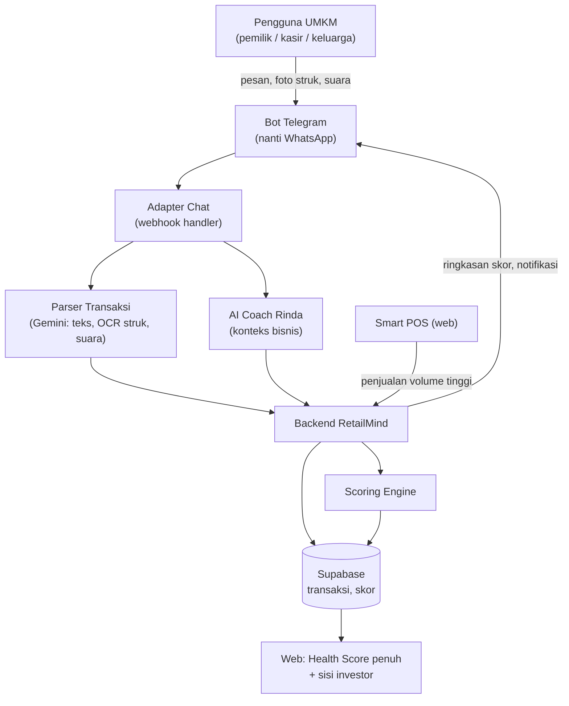

> [!abstract] Tujuan dokumen
> Desain versi chat RetailMind untuk sisi UMKM: pendaftaran, pencatatan transaksi, AI Coach, dan notifikasi proaktif lewat bot. POC memakai Telegram, produksi menuju WhatsApp. Dokumen ini blueprint Fase B, belum kode. Keputusan desain di sini berpijak pada temuan [[04 - Laporan Validasi Sintetis]]. Nama brand "RetailMind" bersifat sementara.

## 1. Ruang lingkup

Versi chat menangani **loop harian sisi UMKM**: masuk, mencatat, memahami, dan diingatkan. Yang tidak masuk versi chat: Health Score penuh dan seluruh sisi investor, keduanya tetap di web ([[07 - Blueprint Versi Website]]). Pembagian ini ditegaskan oleh validasi: alur input dan coaching cocok di chat, tetapi output visual dan screening investor butuh layar.

## 2. Kenapa Telegram untuk POC, WhatsApp untuk produksi

| Aspek | Telegram (POC) | WhatsApp (produksi) |
|---|---|---|
| Akses API | Bot API gratis, instan, tanpa verifikasi | Cloud API, perlu verifikasi bisnis Meta |
| Aturan pesan | Bebas, cocok untuk uji dan simulasi agent | Template dan jendela sesi 24 jam, ada biaya per percakapan |
| Tempat pengguna nyata | Sedikit di UMKM | Mayoritas UMKM ada di sini |
| Peran | Membuktikan alur dan mengukur friksi murah | Kanal produksi pengguna sebenarnya |

## 3. Arsitektur

Komponen inti: **adapter chat** (terima webhook, kelola sesi per nomor), **parser transaksi** (ubah pesan, foto, atau suara jadi entri terstruktur), **AI Coach** (yang sudah ada, tinggal ganti kanal), dan **penyimpan sesi** per pengguna. Penjualan volume tinggi tetap masuk lewat POS, bukan diketik di chat.

## 4. Alur bot

### 4.1 Onboarding (sekali di awal)
1. Pengguna mulai chat, bot menyapa dan menanyakan nama usaha dan kategori (warung, kafe, restoran, catering).
2. Bot menjelaskan singkat, tanpa jargon, bahwa cukup melapor transaksi lewat chat.
3. Tidak ada form panjang, tidak wajib email di langkah awal. Verifikasi menyusul saat pengguna mau membuka fitur web.

### 4.2 Mencatat transaksi (harian)
Tiga cara, dipilih pengguna sesuai kenyamanan:
- **Ketik pesan**: "jual nasi goreng 15rb" atau "beli sayur 200rb". Bot mengonfirmasi hasil parse sebelum menyimpan.
- **Foto struk**: kirim foto, OCR membaca, bot minta konfirmasi.
- **Total harian**: "hari ini masuk 1,2jt keluar 400rb" untuk yang tidak sempat mencatat satuan.

### 4.3 Lihat kondisi dan coach
- Pengguna bisa minta ringkasan: "skor saya berapa", bot mengirim ringkasan singkat plus tautan ke web untuk grafik penuh.
- AI Coach Rinda menjawab pertanyaan bisnis di chat, sama seperti versi web tetapi dalam percakapan.

### 4.4 Notifikasi proaktif
- Bot mengirim sapaan berkala: "Pak, minggu ini pemasukan turun 11 persen, mau saya bantu lihat penyebabnya?" Ini yang membangun kebiasaan dan menahan pengguna tetap aktif.

## 5. Keputusan desain dari validasi

| Temuan validasi | Keputusan desain |
|---|---|
| Kasir menolak mengetik chat saat ramai (Dinda) | Penjualan volume tinggi lewat POS, chat hanya untuk pengeluaran tunai dan pesanan yang bocor dari POS |
| Input harus bisa didelegasikan (Koh Aan) | Satu usaha bisa punya beberapa pelapor (pemilik, keluarga, staf) yang masuk ke satu data yang sama |
| Segmen bawah cash-heavy dan gaptek (Bu Siti, Uda Fauzi) | Dukung foto struk dan pesan suara, konfirmasi sederhana, bahasa sehari-hari |
| Risiko salah input dan lupa (Dinda) | Sediakan cara mudah membatalkan dan mengoreksi entri terakhir |
| Kualitas data menentukan skor | Ukur kelengkapan dan konsistensi, bukan sekadar jumlah pesan |

## 6. Peran provider AI

Untuk POC Telegram, memakai **provider yang sudah terpasang di aplikasi, yaitu Gemini** (`lib/ai/providers/gemini.ts`), sehingga tidak perlu kredensial baru. Tiga fungsi: **parse transaksi** dari bahasa bebas, **OCR dan kategorisasi** foto struk, dan **AI Coach** percakapan. Semua dengan konfirmasi pengguna sebelum data tersimpan, agar salah baca tidak mencemari skor. Arsitektur provider aplikasi sudah multi-provider (Gemini, OpenAI, Anthropic, OpenRouter), jadi bisa ganti provider tanpa mengubah alur bila nanti perlu.

## 7. Metrik POC

- Persentase yang menyelesaikan onboarding.
- Titik drop-off per langkah.
- Metode input yang paling dipakai (ketik, foto, total harian).
- Retensi pelaporan setelah 4 sampai 8 minggu, bukan sekadar coba sekali.

## 8. Batas dan pertanyaan terbuka

Beberapa hal hanya bisa dijawab uji lapangan (lihat [[04 - Laporan Validasi Sintetis]] bagian pertanyaan): akurasi OCR nota tulisan tangan, apakah input total harian cukup untuk skor kredibel, dan porsi segmen yang hanya punya WhatsApp tanpa Telegram.

→ Kembali: [[00 - Spec Desain Validasi Multi-Agent]] · Terkait: [[07 - Blueprint Versi Website]] · [[08 - Solusi Gabungan Hibrida]]
