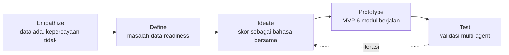

# Paket Bisnis (USP, ROI, Model)

> [!abstract] Tujuan dokumen
> Merangkum paket bisnis produk (nama brand "RetailMind" masih sementara, rename pending) untuk hackathon DIGDAYA X PIDI: USP yang tajam dan tahan bantahan, business case per pemangku kepentingan, model bisnis, kekuatan dan moat, semuanya dijangkarkan ke temuan validasi. Dokumen ini sengaja jujur pasca-kritik. Angka dari [[PROPOSAL_DIGDAYA_2026_v2]] dipakai dengan atribusi, sedangkan angka yang dikritik terlalu optimistis di [[09 - Kritik Proposal (Proof-Driven)]] disajikan ulang sebagai skenario bersyarat.

> [!warning] Dua pengandaian yang harus dinyatakan di depan
> 1. **Monetisasi bergantung pada satu bukti yang belum dimiliki tim**: adanya lembaga pembiayaan nyata yang memakai skor sebagai dasar keputusan kredit. Selama ini belum ada, seluruh proyeksi pendapatan berstatus hipotesis, bukan demand terbukti ([[04 - Laporan Validasi Sintetis]], bagian 4).
> 2. **Validasi yang sudah berjalan adalah pra-validasi sintetis multi-agent**, bukan bukti pasar dari pelanggan nyata. Angka kesediaan bayar bersifat indikatif.

---

## 1. USP (Unique Selling Proposition)

> [!quote] Kalimat inti USP
> Untuk UMKM F&B yang datanya sudah digital tetapi tidak bisa berbicara sebagai bukti performa, produk ini mengubah transaksi harian menjadi skor kesehatan bisnis yang dirancang agar dapat dibaca dan dipakai pemodal, diakses lewat kanal chat yang sudah dipakai sehari-hari sehingga hambatan adopsinya rendah.

Pembeda sejati bukan pada fitur pencatatan, melainkan pada dua hal yang bekerja bersama:

1. **Skor yang dirancang untuk pengambilan keputusan pemodal, bukan untuk arsip internal.** Kompetitor berhenti di laporan keuangan. Produk ini menerjemahkan data operasional menjadi satu bahasa penilaian (Business Health Score 0-100 dan Investment Readiness Low/Medium/High) yang dapat dibaca kedua sisi: pemilik usaha dan penyedia modal.
2. **Kanal chat-first yang menurunkan friksi adopsi.** Pintu masuk lewat chat yang sudah dikenal (WhatsApp untuk produksi, Telegram untuk POC) menekan hambatan email, kata sandi, dan verifikasi yang selama ini memicu pola "coba lalu tinggalkan" pada segmen paling gaptek ([[06 - Analisis Aplikasi & Arah WhatsApp]]).

> [!note] Cara membedakan diri dari kompetitor
> | Pembanding | Berhenti di mana | Di mana produk ini berbeda |
> |---|---|---|
> | Moka, Majoo | Pencatatan transaksi dan laporan operasional | Menambah lapisan skor siap-pemodal di atas data yang sama |
> | Jurnal.id | Laporan keuangan formal | Menerjemahkan laporan jadi sinyal kelayakan danai, bukan sekadar neraca |
> | BukuWarung | Pembukuan ringan lewat ponsel | Skor yang dirancang untuk dibaca pemodal, bukan hanya rekap pribadi |
> | Spreadsheet manual | Rekap yang tidak terverifikasi | Cross-validation antar sumber dan syarat kelengkapan data |

> [!danger] USP yang jujur, tanpa klaim rapuh
> Klaim "satu-satunya platform" dari proposal ([[PROPOSAL_DIGDAYA_2026_v2]], bagian 3.3) sengaja **tidak dipakai**. Klaim absolut mudah dipatahkan satu contoh tandingan, dan kata "dipercaya" belum bisa diklaim selama belum ada pemodal yang benar-benar mempercayai skor ini. Pembeda dirumuskan sebagai **kombinasi dan fokus segmen** (skor siap-pemodal untuk F&B Indonesia plus kanal chat-first), bukan keunikan mutlak. Rumusan ini lebih sempit, tetapi bisa dipertahankan di depan juri.

> [!important] Status kejujuran USP
> Bagian "skor dapat dibaca pemodal" menyatakan **desain**, bukan pengakuan yang sudah terjadi. Skornya dirancang untuk pemodal, tetapi belum ada pemodal yang mengadopsinya. Perbedaan ini harus dijaga dalam setiap penyampaian: yang sudah ada adalah rancangan dan mesin skor yang berjalan, yang masih hipotesis adalah pengakuan eksternal.

---

## 2. ROI dan Business Case per Pemangku Kepentingan

Tiga pihak, tiga logika nilai yang berbeda. Angka disajikan dengan atribusi sumber dan status (terbukti, indikatif, atau hipotesis).

### 2.1 Untuk UMKM F&B

> [!success] Nilai yang ditawarkan
> - **Akses modal lebih cepat.** Data operasional yang tadinya tidak terbaca pemodal diubah menjadi skor dan laporan siap-investor. Digitalisasi data dapat meningkatkan akses kredit hingga 3,5x (McKinsey, 2023, dikutip proposal). Angka ini adalah potensi sektor, bukan hasil produk.
> - **Hemat waktu rekap.** Input lewat chat (foto struk, catat cepat) menekan waktu menyusun laporan bulanan. Persona menyambut ini karena "ngurangin kerjaan, bukan nambahin" (Koh Aan, Uda Fauzi, [[04 - Laporan Validasi Sintetis]]).
> - **Percaya diri saat berhadapan dengan pemodal.** Menjawab kebutuhan emosional dan identitas yang terangkat di tahap Empathize: rasa malu karena tidak bisa membuktikan usaha yang serius.

> [!warning] Syarat agar nilai ini nyata
> Manfaat "akses modal lebih cepat" hanya terwujud bila ada pemodal yang memakai skor. Sampai kemitraan pembiayaan terkunci, nilai untuk UMKM masih terbatas pada hemat waktu rekap dan kesiapan dokumen, bukan pencairan modal yang sesungguhnya. Persona menyebut skor tanpa pemodal di ujungnya sebagai "kalkulator mahal" (Koh Aan).

### 2.2 Untuk Investor dan Lembaga Pembiayaan

> [!success] Nilai yang ditawarkan
> - **Hemat biaya due diligence.** Due diligence manual menelan 2 sampai 4 minggu dan Rp5 juta sampai Rp15 juta per UMKM (proposal, bagian 4.2). Skrining berbasis skor memangkas tahap awal penyaringan.
> - **Screening lebih cepat dan berskala.** Satu analis manual hanya menangani 5 sampai 10 UMKM per bulan (proposal). Dashboard memungkinkan penyaringan banyak UMKM sekaligus berdasar skor, kategori, dan kota.
> - **Standar penilaian yang seragam.** Investment Readiness Score memberi benchmark objektif antar UMKM yang sebelumnya tidak ada.

> [!danger] Koreksi klaim dampak
> Proposal menyebut "mengurangi biaya due diligence hingga 80%" dan "screening 50+ UMKM dalam satu hari" sebagai fakta. Disajikan ulang secara jujur: ini **potensi target**, bukan hasil terukur, karena belum ada satu pun asesmen investor nyata di platform ([[09 - Kritik Proposal (Proof-Driven)]], bagian 3). Nilai bagi investor baru terbukti setelah pilot menjalankan asesmen sungguhan.

### 2.3 Untuk Platform (Unit Economics)

Ini bagian yang dikritik paling keras karena LTV/CAC 12x sampai 36x dan payback kurang dari 1 bulan mengandaikan retensi 12 bulan penuh tanpa syarat. Berikut versi jujur dengan asumsi retensi eksplisit dan dua skenario.

> [!note] Asumsi dasar (dengan atribusi)
> - Harga Pro: Rp149.000 per bulan (proposal, bagian 7).
> - CAC UMKM via komunitas: Rp50.000 sampai Rp150.000 (proposal, bagian 11). Untuk perhitungan dipakai titik tengah Rp100.000.
> - Retensi: **tidak diasumsikan aman**. Validasi menempatkan retensi sebagai pertanyaan terbuka karena pola musiman, alternatif gratis, dan pola 80% kembali ke manual (SNAM 2025).

| Skenario retensi | Bulan bertahan | LTV (Rp149rb x bulan) | LTV/CAC (CAC Rp100rb) | Tafsir |
|---|---|---|---|---|
| Konservatif | 3 bulan | Rp447.000 | 4,5x | Realistis bila pola musiman dominan dan bukti pemodal belum kuat |
| Menengah | 6 bulan | Rp894.000 | 8,9x | Mungkin bila Free vs Pro jelas menyambung ke pendanaan |
| Optimis | 12 bulan | Rp1.788.000 | 17,9x | Angka proposal, hanya benar bila konversi dan retensi terbukti |

> [!important] Metrik kunci yang harus diuji, bukan diasumsikan
> - **Retensi bulan ke-2** adalah metrik nomor satu di pilot. Bukan minat, melainkan berapa lama orang tetap membayar setelah satu siklus, baik dapat maupun tidak dapat modal.
> - **Konversi Free ke Pro** disajikan sebagai hipotesis yang ditautkan ke pencapaian kemitraan pembiayaan, bukan target percaya diri 10%.
> - **Payback period** bersifat bersyarat: kurang dari 1 bulan hanya benar pada skenario optimis. Pada skenario konservatif payback tetap tercapai dalam 1 sampai 2 bulan karena CAC rendah, tetapi hanya jika pengguna benar bertahan membayar.

---

## 3. Business Model

### 3.1 Revenue Streams (disesuaikan temuan validasi)

> [!warning] Pergeseran penting dari proposal
> Proposal menempatkan Pro Rp149.000 per bulan sebagai "revenue stream utama". Validasi membalik urutan ini. Kunci monetisasi adalah **kemitraan pembiayaan** (matching fee dan B2B API ke lembaga), bukan langganan Pro. Selama skor belum diakui pemodal, langganan Pro sulit terkonversi dan sulit dipertahankan.

| Aliran pendapatan | Tarif (atribusi proposal) | Peran | Status |
|---|---|---|---|
| Free (UMKM) | Rp0 | Akuisisi dan pengumpulan data (mesin data flywheel) | Ada |
| Pro (UMKM) | Rp149.000 per bulan | Pendukung, bukan tumpuan utama | Hipotesis, bergantung bukti pemodal |
| Investor Access | Rp299.000 per bulan | Sekunder | Hipotesis |
| **API License B2B** | Rp2 juta sampai Rp5 juta per bulan | **Kunci**, jual skor sebagai pre-screening ke lembaga | Belum ada kemitraan |
| **Matching Fee** | 1% sampai 2% per deal | **Kunci jangka panjang**, monetisasi saat modal cair | Belum ada kemitraan |

### 3.2 Opsi harga yang mengakomodasi pola musiman

> [!note] Usulan struktur harga baru
> Validasi menemukan dua keberatan berulang terhadap langganan bulanan tetap: kebutuhan musiman (Mas Aldi ingin bayar hanya saat menyusun proposal lalu berhenti, Bu Endah dan Uda Fauzi menyorot bulan sepi pasca-Lebaran) dan alternatif gratis dianggap cukup.
>
> | Opsi | Bentuk | Untuk siapa |
> |---|---|---|
> | Bayar saat butuh | Per proposal atau per musim pengajuan modal | Pemilik yang butuh laporan hanya ketika mengajukan pendanaan |
> | Paket tahunan | Diskon dibanding 12x bulanan | Pemilik yang butuh pemantauan berkelanjutan |
> | Bulanan | Dipertahankan sebagai pilihan | Pengguna aktif yang butuh skor terus terpantau |
>
> Mengakui pola musiman secara terbuka justru menunjukkan tim mendengar pasar, bukan kelemahan.

### 3.3 Business Model Canvas ringkas

| Blok | Isi |
|---|---|
| **Customer Segments** | Primer: UMKM F&B omzet Rp10-200 juta per bulan (warung, kafe, restoran kecil, katering). Sekunder: investor ritel, BPR, koperasi, fintech P2P. Catatan: segmen bakery di-drop, tidak lagi disebut. |
| **Value Propositions** | UMKM: skor siap-pemodal, hemat waktu rekap, akses lewat chat. Pemodal: skrining cepat berskala, standar objektif, hemat due diligence. |
| **Channels** | Chat (WhatsApp produksi, Telegram POC) sebagai pintu masuk UMKM. Web sebagai ruang baca mendalam dan satu-satunya kanal investor. B2B: kemitraan lembaga pembiayaan. |
| **Customer Relationships** | UMKM: swalayan plus AI Coach proaktif di chat. Investor: dashboard swalayan plus akses API. Lembaga: kemitraan terkelola. |
| **Revenue Streams** | Kunci: API License B2B dan Matching Fee. Pendukung: Pro dan Investor Access. Free untuk akuisisi. Opsi harga musiman. |
| **Key Resources** | Mesin skor 6 komponen (berjalan), MVP 6 modul (berjalan), basis data transaksi terverifikasi (flywheel, masih tipis), tim. |
| **Key Activities** | Kembangkan kanal chat, latih dan kalibrasi model skor, rintis kemitraan pembiayaan, jaga kualitas data input. |
| **Key Partners** | BPR, koperasi, fintech P2P (kunci monetisasi), penyedia data marketplace (GoFood/GrabFood), cloud, ekosistem regulator. |
| **Cost Structure** | Engineering dan AI 60%, biaya API AI 20%, marketing 15%, operasi 5% (proposal, bagian 7). |

---

## 4. Kekuatan dan Moat

> [!important] Jujur memisahkan yang sudah ada dari yang masih hipotesis
> | Aset | Klaim | Status jujur |
> |---|---|---|
> | **Produk berjalan** | MVP 6 modul aktif, dapat didemonstrasikan live | **Sudah ada.** Ini kekuatan paling kokoh dan paling bisa dibuktikan di depan juri. |
> | **Scoring khusus F&B Indonesia** | Model 6 komponen tertimbang berbasis konteks F&B | **Sudah ada** sebagai algoritma. Yang belum: kalibrasi dengan data lapangan nyata dan pengakuan pemodal. |
> | **Model chat-first** | Pintu masuk chat menekan friksi adopsi | **Sebagian.** Arah sudah diputuskan dan diblueprint ([[08 - Solusi Gabungan Hibrida]]), bot Telegram POC dalam pembangunan. Belum berjalan penuh di produksi. |
> | **Data flywheel** | Makin banyak transaksi, makin tajam skor dan benchmark | **Hipotesis.** Mekanismenya masuk akal, tetapi basis data masih tipis. Flywheel baru berputar setelah ada volume pengguna nyata. |
> | **Tim** | Tim AI UGM dengan latar ML dan business development | **Sudah ada**, tetapi klaim komposisi harus dirapikan. Tabel memuat ketua plus tiga anggota, salah satunya Marketing Strategist, bukan semua AI. |

> [!danger] Moat yang belum terbentuk, dan justru itu prioritasnya
> Moat terkuat produk ini bukan teknologi (mudah ditiru) melainkan **jaringan kemitraan pembiayaan yang mengakui skor**. Begitu satu lembaga memakai skor sebagai pre-screening, terbentuk efek jaringan: makin banyak UMKM mengejar skor karena membuka modal, makin banyak pemodal ikut karena ada pipeline terskrining. Moat ini **belum ada**. Membangunnya adalah prioritas nomor satu, bukan menambah fitur.

---

## 5. Landasan Design Thinking

Tiap poin paket bisnis ini berakar pada tahap Empathize sampai Test ([[01 - Design Thinking]]).

| Poin paket bisnis | Tahap Design Thinking | Kaitan |
|---|---|---|
| USP "skor siap-pemodal" | Define | Masalah inti bukan "belum digital" melainkan data readiness: data ada tetapi tidak bisa jadi bukti. USP menjawab persis ini. |
| USP "kanal chat-first" | Test (iterasi) | Analisis aplikasi live menunjukkan input web terlalu berat bagi persona warung. Test menghasilkan pergeseran ke chat-first. |
| ROI UMKM "akses modal, hemat waktu" | Empathize | Kebutuhan fungsional, emosional, dan identitas yang terangkat dari 15 UMKM Yogyakarta dan lima persona. |
| ROI investor "skrining berskala" | Define (POV Investor) | POV investor: butuh menyaring UMKM layak danai secara cepat dan seragam, tetapi tidak ada standar objektif. |
| Revenue kunci = kemitraan pembiayaan | Test | Temuan WTP paling penting: kesediaan bayar bersyarat pada bukti skor dipakai pemodal nyata. |
| Opsi harga musiman | Test | Keberatan berulang terhadap langganan bulanan tetap saat bulan sepi. |
| Moat = jaringan pemodal | Test | Gap utama yang belum terjawab justru menunjuk ke tempat moat harus dibangun. |

> [!success] Prinsip penutup
> Kekuatan paket ini bukan pada angka terbesar, melainkan pada produk yang benar-benar berjalan dan validasi yang jujur mengakui satu gap penentu. Cara meyakinkan pemodal dan juri bukan menaikkan klaim, tetapi menurunkannya sampai persis sekuat bukti, lalu menunjukkan langkah berikutnya sudah jelas: kunci satu kemitraan pembiayaan.

→ Sumber: [[04 - Laporan Validasi Sintetis]] · [[08 - Solusi Gabungan Hibrida]] · [[09 - Kritik Proposal (Proof-Driven)]] · [[01 - Design Thinking]] · Objek: [[PROPOSAL_DIGDAYA_2026_v2]]
