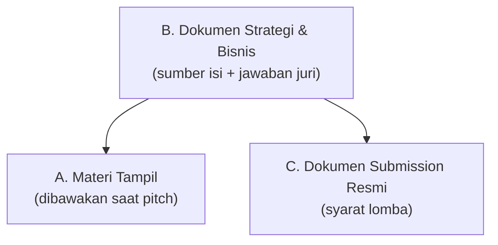
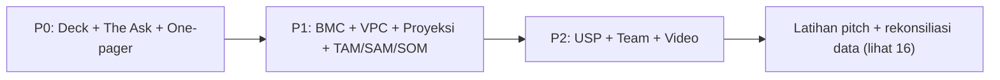

> [!abstract] Tujuan dokumen
> Satu peta untuk semua dokumen yang perlu disiapkan saat pitching RetailMind AI di DIGDAYA X Hackathon PIDI: apa saja, mengacu best practice mana, sudah ada atau belum di vault ini, dan urutan penyusunannya. Dipakai sebagai daftar kerja sampai hari tampil.

> [!warning] Verifikasi dulu ke penyelenggara
> Daftar di bawah adalah **standar pitch startup** (best practice umum). Persyaratan resmi DIGDAYA/PIDI (format proposal, batas slide, wajib video atau tidak, kelengkapan administrasi) tetap harus dicek ke panduan lomba. Yang ada di vault: proposal resmi ([[15 - Proposal DIGDAYA 2026 (Ringkasan)]]) dan form Q&A Tahap 2 ([[17 - Pertanyaan & Jawaban Tahap 2]]).

## 1. Best practice yang jadi acuan

| Kerangka | Inti | Dipakai untuk |
|---|---|---|
| **Sequoia Capital** (12 slide) | Narasi berbasis data: pasar, model bisnis, tim | Struktur deck |
| **Y Combinator** (minimalis) | Fokus 4 hal: problem, solution, business model, traction | Menjaga deck ringkas |
| **Guy Kawasaki 10/20/30** | Maksimal 10 slide, 20 menit, font minimal 30pt, 1 ide per slide | Disiplin visual & durasi |
| **Business Model Canvas** (Osterwalder, 9 blok) | Satu halaman: segmen, value prop, channel, revenue, cost, dll | Dokumen strategi, bukan slide |
| **Value Proposition Canvas** | Peta jobs, pains, gains pelanggan vs produk | Menghubungkan persona ke solusi |

> [!note] Aturan penting deck
> BMC dan Value Proposition Canvas **jangan ditempel utuh sebagai slide**. Keduanya dokumen kerja yang menyuplai isi slide, bukan slide itu sendiri (Pitch Deck Fire, NYU Startup Guide). Satu slide menjawab satu pertanyaan investor.

## 2. Tiga kategori dokumen

- **A. Materi tampil:** yang dilihat juri langsung (deck, one-pager, demo, video).
- **B. Dokumen strategi:** bahan baku dan senjata cadangan saat sesi tanya jawab.
- **C. Submission resmi:** berkas wajib yang dikumpulkan.

## 3. Master checklist

Legenda status: ✅ Ada · 🟡 Sebagian (perlu dirapikan/diangkat) · ❌ Belum ada

### A. Materi tampil

| # | Dokumen | Fungsi | Status | Lokasi / catatan |
|---|---|---|---|---|
| A1 | **Pitch Deck** (10-12 slide) | Alat utama presentasi | 🟡 | Draft isi 12 slide di [[19 - Outline Pitch Deck]], tinggal desain visual PPT/Canva |
| A2 | Naskah & narasi pitch (5 menit) | Panduan bicara | ✅ | [[13 - Pitch & Antisipasi Juri]] |
| A3 | **One-pager / executive one-sheet** | Handout ringkas 1 halaman | ✅ | [[20 - One-Pager & The Ask]] (bagian 1) |
| A4 | Demo produk (working prototype) | Bukti nyata, bukan klaim | ✅ | [[06 - Modul Produk]] · [[10 - Data, Demo & Visualisasi]] (skenario 90 detik + akun demo) |
| A5 | Video pitch/demo | Jika diminta panitia | 🟡 | Cek requirement. Referensi konsep video ada di hackathon Microsoft |

### B. Dokumen strategi & bisnis

| # | Dokumen | Fungsi | Status | Lokasi / catatan |
|---|---|---|---|---|
| B1 | **Business Model Canvas** (9 blok) | Ringkas model bisnis 1 halaman | ✅ | [[11a - Business Model Canvas]] |
| B2 | **Value Proposition Canvas** | Peta jobs/pains/gains vs produk | ✅ | [[04b - Value Proposition Canvas]] |
| B3 | User Persona | Wajah customer & user | ✅ | [[04a - Persona Customer & User]] |
| B4 | USP / Unique Value Proposition | Satu kalimat pembeda | 🟡 | Kuat di [[08 - Keunggulan & Diferensiasi]], perlu 1 pernyataan baku untuk slide |
| B5 | Business model & revenue | Cara menghasilkan uang | ✅ | [[11 - Business Model & GTM]] |
| B6 | **Financial model / proyeksi 3 tahun** | Angka pertumbuhan & keberlanjutan | ✅ | [[11b - Proyeksi Finansial 3 Tahun]] |
| B7 | Market research (TAM/SAM/SOM) | Ukuran & bukti pasar | ✅ | [[04c - TAM SAM SOM]] (data dasar di [[04 - Riset Pasar F&B Indonesia]]) |
| B8 | Competitive analysis & moat | Kenapa sulit ditiru | ✅ | [[08 - Keunggulan & Diferensiasi]] |
| B9 | Product & feature spec | Detail modul & scoring | ✅ | [[06 - Modul Produk]] · [[07 - Scoring Engine]] |
| B10 | Technical architecture | Bukti kelayakan teknis | ✅ | [[09 - Arsitektur & Teknologi]] |
| B11 | Traction & metrics/KPI | Bukti momentum | ✅ | [[12 - Roadmap & Metrik Sukses]] (working prototype + seed data) |
| B12 | Roadmap | Rencana ke depan | ✅ | [[12 - Roadmap & Metrik Sukses]] |
| B13 | Go-to-market | Cara akuisisi | ✅ | [[11 - Business Model & GTM]] |
| B14 | Team & roles | Kredibilitas pelaksana | 🟡 | Ada di [[00 - Beranda (MOC)]] & proposal, belum jadi profil ringkas 1 halaman |
| B15 | **The Ask** | Yang diminta ke juri/mitra | ✅ | [[20 - One-Pager & The Ask]] (bagian 2) |

### C. Submission resmi

| # | Dokumen | Status | Lokasi / catatan |
|---|---|---|---|
| C1 | Proposal resmi | ✅ | [[15 - Proposal DIGDAYA 2026 (Ringkasan)]] · [[16 - Perbaikan Proposal]] |
| C2 | Form Q&A Tahap 2 | ✅ | [[17 - Pertanyaan & Jawaban Tahap 2]] · folder FIX FINAL SUBMISSION |
| C3 | Kelengkapan administrasi (portofolio, identitas, surat) | 🟡 | Portofolio tim ada; cek sisa syarat ke panduan lomba |

## 4. Blueprint Pitch Deck (12 slide, gaya Sequoia disederhanakan)

Setiap slide menjawab satu pertanyaan dan menarik isinya dari dokumen yang sudah ada.

| Slide | Pertanyaan yang dijawab | Sumber isi | Siap? |
|---|---|---|---|
| 1. Cover + tagline | Siapa kalian, satu kalimat | Brand di [[15 - Proposal DIGDAYA 2026 (Ringkasan)]] · "Setiap Transaksi Membangun Kepercayaan" | ✅ |
| 2. Problem | Kenapa ini penting sekarang | [[02 - Masalah UMKM F&B]] · [[03 - Kebutuhan & Peran Investor]] | ✅ |
| 3. Market opportunity | Sebesar apa pasarnya | [[04c - TAM SAM SOM]] · [[04 - Riset Pasar F&B Indonesia]] | ✅ |
| 4. Solution | Apa jawabannya | [[05 - Ikhtisar Produk]] · [[06 - Modul Produk]] | ✅ |
| 5. Product / cara kerja | Bagaimana bekerjanya | [[06 - Modul Produk]] · [[10 - Data, Demo & Visualisasi]] · [[07 - Scoring Engine]] | ✅ |
| 6. Demo | Buktinya | [[10 - Data, Demo & Visualisasi]] (skenario 90 detik) | ✅ |
| 7. USP / kompetisi / moat | Kenapa kalian menang | [[08 - Keunggulan & Diferensiasi]] (perlu 1 baris USP, B4) | 🟡 |
| 8. Business model | Cara menghasilkan uang | [[11 - Business Model & GTM]] | ✅ |
| 9. Go-to-market & traction | Sudah sejauh apa, mau ke mana | [[11 - Business Model & GTM]] · [[12 - Roadmap & Metrik Sukses]] | ✅ |
| 10. Financials / proyeksi | Angka keberlanjutan | [[11b - Proyeksi Finansial 3 Tahun]] | ✅ |
| 11. Team | Kenapa kalian yang tepat | [[00 - Beranda (MOC)]] · profil ringkas (B14) | 🟡 |
| 12. The Ask + closing | Apa yang kalian minta | [[20 - One-Pager & The Ask]] + closing tagline [[13 - Pitch & Antisipasi Juri]] | ✅ |

> [!tip] Versi 10 slide (Kawasaki)
> Kalau durasi ketat, gabung: slide 4+5 (Solution+Product) dan 8+9 (Model+GTM). Sisakan Demo dan The Ask utuh, keduanya paling menentukan.

## 5. Yang perlu disiapkan (gap, urut prioritas)

> [!success] Sudah dibuat (12 Juli 2026)
> Draft deck 12 slide [[19 - Outline Pitch Deck]] · The Ask & one-pager [[20 - One-Pager & The Ask]] · BMC [[11a - Business Model Canvas]] · VPC [[04b - Value Proposition Canvas]] · Proyeksi finansial [[11b - Proyeksi Finansial 3 Tahun]] · TAM/SAM/SOM [[04c - TAM SAM SOM]] · Persona [[04a - Persona Customer & User]].

> [!warning] Sisa pekerjaan
> 1. **A1 Desain slide:** ubah outline [[19 - Outline Pitch Deck]] jadi PPT/Canva bervisual (isi sudah siap).
> 2. **B4 USP:** angkat satu kalimat baku dari [[08 - Keunggulan & Diferensiasi]] ke slide 7.
> 3. **B14 Team:** profil ringkas 1 halaman (foto + peran).
> 4. **A5 Video:** buat jika panduan lomba mewajibkan.
> 5. **C3 Administrasi:** cek sisa syarat berkas ke panduan DIGDAYA/PIDI.
> 6. Rekonsiliasi data [[16 - Perbaikan Proposal]] sebelum semua diekspor.

## 6. Rencana penyusunan

Sebelum tampil, rapikan titik rawan yang sudah dicatat di [[16 - Perbaikan Proposal]] (samakan demo store, sumber angka Rp2.400T, provider AI) supaya deck, proposal, dan demo konsisten.

## 7. Sumber best practice

- [Ink Narrates: format Sequoia, YC, Guy Kawasaki](https://www.inknarrates.com/post/pitch-deck-format-sequoia-yc-guy-kawasaki)
- [Shoutex: 10 slide wajib dalam pitch deck](https://shoutex.com/blog/10-slides-pitch-deck)
- [Upmetrics: Guy Kawasaki 10/20/30](https://upmetrics.co/pitch-deck-examples/guy-kawasaki)
- [Creately: beda Business Model Canvas & Value Proposition Canvas](https://creately.com/guides/bmc-and-vpc/)
- [Pitch Deck Fire: apa itu Business Model Canvas](https://pitchdeckfire.com/resources/what-is-the-business-model-canvas-overview/)
- [NYU Startup Guide: Canvas, Models & Plans](https://guides.nyu.edu/startups/canvas-model-plan)

→ Kembali: [[00 - Beranda (MOC)]] · Terkait: [[13 - Pitch & Antisipasi Juri]] · [[04a - Persona Customer & User]]
