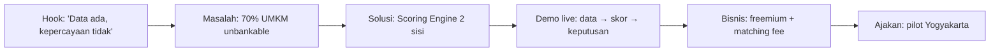

> [!abstract] Narasi pitch (didukung data)
> 65 juta UMKM = ekonomi Indonesia, **tapi ~70% tak bisa akses kredit** karena tak punya data terpercaya → gap pembiayaan ≈ Rp2.400T / USD 234 miliar. Infrastruktur digital (32 juta merchant QRIS) sudah ada, fintech siap menyalurkan (P2P +27%/tahun) — **yang hilang adalah jembatan data tepercaya. RetailMind AI mengisi celah itu.**

## Struktur Pitch (5 menit)

1. **Hook (30 dtk):** cerita riset 15 UMKM Yogyakarta — tak ada yang bisa jawab laba bulan lalu.
2. **Masalah (45 dtk):** angka kunci ([[01 - Ringkasan Eksekutif]]).
3. **Solusi (60 dtk):** 3 modul + 2 skor ([[05 - Ikhtisar Produk]], [[07 - Scoring Engine]]).
4. **Demo (90 dtk):** skenario di [[10 - Data, Demo & Visualisasi]].
5. **Bisnis + dampak (45 dtk):** [[11 - Business Model & GTM]], [[12 - Roadmap & Metrik Sukses]].
6. **Closing (30 dtk):** *"Setiap Transaksi Membangun Kepercayaan."*

## Antisipasi Pertanyaan Juri

> [!question] "Apa bedanya dengan Moka/Majoo/Jurnal?"
> Mereka berhenti di pencatatan & laporan. Kami menghasilkan **skor & keputusan investasi**. Kami bukan pesaing POS, kami lapisan di atasnya. → [[08 - Keunggulan & Diferensiasi]]

> [!question] "Bagaimana mencegah UMKM memanipulasi data agar skor naik?"
> `data_consistency_score` & `reporting_quality_score` mengukur konsistensi lintas waktu; cross-validation POS vs Cashbook mendeteksi anomali; data harian ber-timestamp sulit direkayasa; skor butuh data ≥60% completeness & ≥90 hari. → [[07 - Scoring Engine]]

> [!question] "Apakah skornya valid/akurat?"
> Model berbobot transparan (6 komponen) yang dipetakan ke kriteria due diligence riil (5C, kolektibilitas OJK). Akan divalidasi dengan data nyata di pilot. → [[03 - Kebutuhan & Peran Investor]]

> [!question] "Bagaimana monetisasi & keberlanjutan?"
> Freemium → Pro Rp149K → Investor Rp299K → API B2B → matching fee. LTV/CAC 12–36×. → [[11 - Business Model & GTM]]

> [!question] "Privasi data UMKM ke investor?"
> RLS: investor hanya melihat skor & ringkasan, **tidak pernah** transaksi/cashbook mentah. → [[09 - Arsitektur & Teknologi]]

> [!question] "Kenapa F&B dulu?"
> Subsektor No.1 ekonomi kreatif (~41–43% PDB ekraf), 4,85 juta usaha, cashflow harian jelas → ideal untuk scoring. → [[04 - Riset Pasar F&B Indonesia]]

> [!question] "Apa yang sudah jadi vs rencana?"
> 6 modul aktif (Working Prototype), bisa demo live hari ini. Rencana: OCR, integrasi marketplace, B2B API. → [[06 - Modul Produk]]

> [!danger] Titik rawan yang harus dirapikan sebelum tampil
> Samakan demo store, sumber angka Rp2.400T, dan provider AI. Detail: [[16 - Perbaikan Proposal]].

→ Penilaian juri internal: [[14 - Penilaian Juri (Review)]] · Kembali: [[00 - Beranda (MOC)]]

> [!question] "Apakah butuh izin OJK/BI untuk credit scoring?"
> Saat ini RetailMind menyediakan **skor & data**, bukan menyalurkan dana sendiri — belum masuk rezim izin penyelenggara P2P. Saat masuk fase matching/penyaluran, kami bermitra dengan lembaga berizin (BPR/Fintech P2P) dan mengikuti POJK terkait + arah Innovative Credit Scoring OJK.

> [!question] "Cold-start: bagaimana mendapat investor pertama?"
> Mulai dari kemitraan **BPR/Koperasi lokal Yogyakarta** yang sudah punya *appetite* UMKM F&B tapi kekurangan *deal flow* tersaring — RetailMind menyediakannya.

> [!question] "Bagaimana memvalidasi model scoring akurat?"
> Backtest terhadap data seed, lalu validasi 90 hari pilot: bandingkan skor vs realisasi pembayaran/pertumbuhan, kalibrasi ulang bobot komponen.

> [!question] "UMKM churn setelah dapat pendanaan?"
> Skor harus dijaga untuk pendanaan berikutnya & syarat lender; AI Coach + laporan periodik + visibilitas investor membuat platform tetap relevan pasca-pendanaan.
