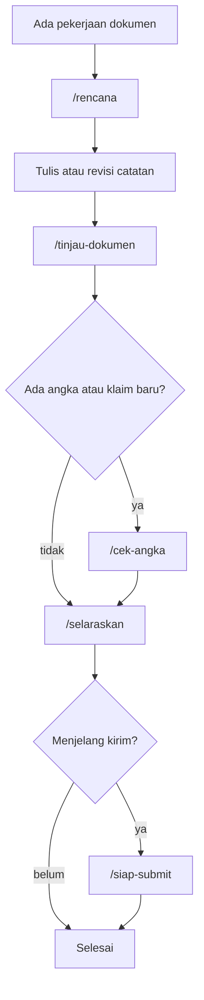

# 🤖 Perkakas Claude Code untuk Vault Ini

> [!abstract] Ringkas
> Vault ini dilengkapi perkakas AI yang dipasang di direktori tersembunyi `.claude/`. Isinya delapan agent, sembilan slash command, tujuh skill, enam aturan tetap, dan tiga mode kerja — semuanya disesuaikan untuk pekerjaan **dokumen**, bukan pekerjaan kode.
> Asalnya dari repo publik [everything-claude-code](https://github.com/WorldFlowAI/everything-claude-code) (lisensi MIT), yang aslinya untuk proyek perangkat lunak lalu diadaptasi ke kebutuhan vault ini.
> **Catatan ini rujukan, bukan bagian argumen proposal.** Isinya tidak dipakai untuk penilaian juri.

> [!info] Kenapa tidak terlihat di Obsidian
> Semua berkasnya ada di `.claude/`, dan Obsidian tidak menampilkan folder berawalan titik. Jadi perkakas ini tidak mengotori pencarian, graph view, maupun quick switcher. Untuk melihat isinya, buka folder vault lewat file explorer atau editor kode.

## 🎯 Kenapa ini ada

Tiga kesalahan yang paling mahal di lomba ini berulang di setiap putaran revisi:

1. **Angka berbeda antar catatan.** Satu angka diperbaiki di proposal, tapi versi lamanya tertinggal di ringkasan eksekutif dan di naskah pitch. Juri yang membandingkan dua dokumen langsung kehilangan kepercayaan.
2. **Klaim melampaui bukti.** Hasil panel persona sintetis mudah terbaca seolah hasil wawancara lapangan kalau kalimatnya tidak hati-hati. Lihat [[04 - Laporan Validasi Sintetis]] dan [[03 - Metode Validasi Multi-Agent]].
3. **Navigasi tertinggal.** Catatan ditambah atau dipindah, tapi [[00 - Beranda (MOC)]] dan README tidak ikut diperbarui, sehingga pembaca baru tersesat.

Perkakas di `.claude/` dibuat untuk menutup ketiganya secara mekanis, bukan mengandalkan ingatan.

## ⌨️ Command yang paling sering dipakai

| Command | Untuk apa | Kapan |
|---|---|---|
| `/cek-angka` | Audit konsistensi angka lintas catatan terhadap [[Sumber & Asumsi Angka]] | Setiap kali ada angka berubah, wajib sebelum submission |
| `/tinjau-dokumen` | Tinjauan kualitas catatan: struktur, klaim, nada, tautan | Setelah menulis, sebelum dianggap final |
| `/validasi-agent` | Panel persona sintetis menguji dokumen, fitur, atau naskah | Saat ingin tahu keberatan UMKM, bank, atau investor |
| `/siap-submit` | Daftar periksa kesiapan kirim, termasuk cek placeholder dan rubrik | Sebelum berkas dikirim ke panitia |
| `/selaraskan` | Menyinkronkan MOC, README, STATUS, dan wikilink | Setelah menambah, memindah, atau mengganti nama catatan |
| `/rencana` | Menyusun rencana sebelum ada catatan yang disentuh | Sebelum pekerjaan besar seperti menulis ulang satu bab |
| `/titik-simpan` | Menyimpan keadaan kerja supaya sesi berikutnya bisa lanjut | Sebelum sesi panjang berakhir |
| `/orkestrasi` | Memecah pekerjaan besar jadi tugas paralel | Saat satu permintaan menyentuh banyak catatan |
| `/belajar` | Menyaring pelajaran berulang jadi aturan tetap | Ketika koreksi yang sama muncul berkali-kali |

Daftar lengkap beserta agent dan skill ada di `.claude/README.md`.

## 🔁 Alur kerja yang disarankan

Untuk menguji ide atau naskah sebelum dipakai: `/validasi-agent` → perbaiki berdasarkan keberatan terkuat → `/validasi-agent` sekali lagi untuk melihat apakah keberatannya benar-benar tertutup. Metodenya sama dengan yang sudah dipakai di [[03 - Metode Validasi Multi-Agent]], hanya dibakukan supaya hasilnya bisa diulang.

> [!warning] Batas yang harus diingat
> Panel persona menghasilkan **validasi sintetis**, bukan riset lapangan. Berguna untuk menemukan keberatan yang belum terpikirkan, tidak berguna sebagai bukti permintaan pasar. Setiap laporan yang memakainya wajib menyebut keterbatasan itu, persis seperti yang sudah dilakukan di [[04 - Laporan Validasi Sintetis]].

## 🧩 Yang dipakai dan yang tidak

Repo asalnya dibuat untuk proyek perangkat lunak. Bagian yang tidak relevan dengan vault dokumentasi tidak diaktifkan, tetapi tetap disimpan utuh di `.claude/vendor/` karena tim juga punya repo aplikasi terpisah tempat isi aslinya justru berguna.

| Dipakai di sini | Tidak dipakai di sini |
|---|---|
| Perencanaan, tinjauan dokumen, penyelarasan navigasi, verifikasi klaim, tinjauan kepatuhan, manajemen konteks | TDD, perbaikan build, uji E2E, pola backend dan frontend, deteksi package manager |

Rincian pemetaannya ada di `.claude/vendor/SUMBER.md`, lengkap dengan commit yang diambil dan catatan lisensi.

> [!danger] Satu hook bawaan repo asal sengaja dibuang
> Konfigurasi hook aslinya memblokir pembuatan berkas `.md` di luar beberapa nama tertentu. Di vault yang seluruh isinya berkas `.md`, aturan itu akan melumpuhkan pekerjaan. Hook pengganti sudah ditulis ulang dan **tidak ada yang aktif secara bawaan** — mengaktifkannya keputusan pemilik repo, caranya ada di `.claude/README.md`.

## 👤 Untuk anggota tim yang baru ikut

1. Pasang [Claude Code](https://claude.com/claude-code), lalu jalankan dari folder vault ini.
2. Perkakasnya langsung terbaca; tidak ada pemasangan tambahan.
3. Mulai dengan mengetik `/` untuk melihat daftar command.
4. Aturan kerja yang selalu berlaku ada di `.claude/rules/`, ringkasannya di `CLAUDE.md` pada root vault.
5. Berkas `.mcp.json` berisi kunci API dan sengaja tidak ikut di-commit. Kalau butuh sambungan Obsidian, minta panduannya ke pemilik repo.

## 🔗 Terkait

- [[00 - Beranda (MOC)]] — titik masuk seluruh vault
- [[Sumber & Asumsi Angka]] — rujukan yang dipakai `/cek-angka`
- [[03 - Metode Validasi Multi-Agent]] — metode yang dibakukan jadi `/validasi-agent`
- [[04 - Laporan Validasi Sintetis]] — contoh keluaran panel persona
- [[Jawaban Tahap 3 (FINAL)]] — dokumen yang diperiksa `/siap-submit`
