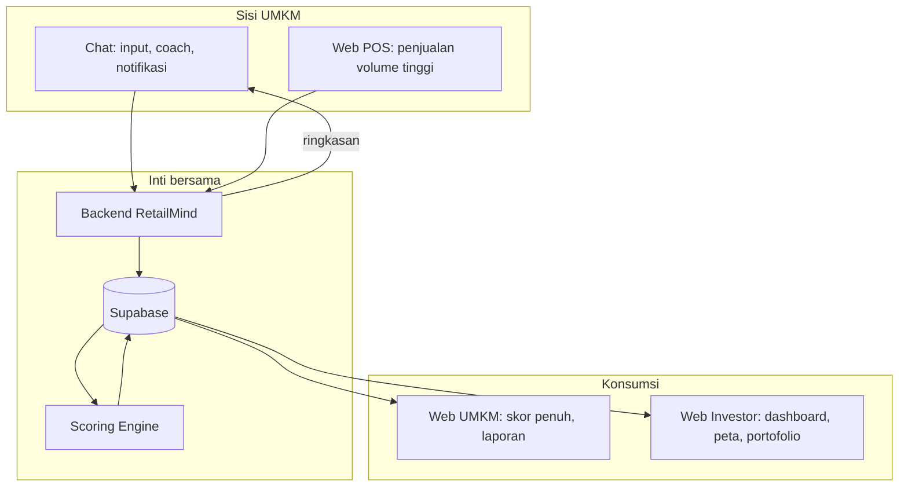

> [!abstract] Tujuan dokumen
> Menggabungkan versi chat ([[05 - Blueprint Versi Telegram (Chat)]]) dan versi web ([[07 - Blueprint Versi Website]]) menjadi satu solusi utuh, dengan rekomendasi arah yang tepat berdasarkan temuan [[04 - Laporan Validasi Sintetis]]. Nama brand "RetailMind" bersifat sementara.

## 1. Ide inti solusi

Satu produk, satu backend, **dua pintu masuk** yang melayani dua pekerjaan berbeda:

- **Chat (WhatsApp, POC Telegram)** menjadi pintu masuk dan mesin kebiasaan sisi UMKM: mencatat, bertanya, diingatkan.
- **Web** menjadi ruang baca mendalam dan satu-satunya kanal investor: skor penuh, laporan siap-investor, screening, portofolio.

Keduanya berbagi data yang sama. Transaksi dari chat dan penjualan dari POS mengalir ke satu basis data, diolah scoring engine, lalu ditampilkan sebagai grafik di web dan ringkasan di chat.

## 2. Arsitektur gabungan

## 3. Pembagian tugas per kanal

| Fungsi | Chat | Web |
|---|---|---|
| Pendaftaran cepat | Utama | Opsional |
| Input pengeluaran tunai dan pesanan | Utama | Cadangan |
| Penjualan volume tinggi (kasir) | Tidak | Utama (POS) |
| AI Coach percakapan | Utama | Ada juga |
| Notifikasi proaktif | Utama | Tidak |
| Health Score penuh dan grafik | Ringkasan saja | Utama |
| Laporan siap-investor / PDF | Tautan | Utama |
| Seluruh sisi investor | Tidak | Utama dan satu-satunya |

## 4. Bagaimana solusi ini menjawab temuan validasi

| Temuan validasi | Jawaban solusi hibrida |
|---|---|
| Aplikasi rumit ditinggalkan (Bu Siti) | Pintu masuk lewat chat yang sudah dikenal, tanpa aplikasi baru dan tanpa form berat |
| Chat kalah cepat dari POS saat ramai (Dinda) | Penjualan volume tinggi tetap di POS, chat hanya menambal yang bocor |
| Input harus bisa didelegasikan (Koh Aan) | Beberapa pelapor per usaha masuk ke satu data |
| Investor butuh alat visual (dashboard, peta) | Sisi investor tetap dan hanya di web |
| "Yang penting cair, bukan skor" (Bu Endah) | Lihat bagian 5, penyambungan ke pendanaan menjadi inti nilai, bukan skor semata |

## 5. Titik paling menentukan: sambungkan skor ke pencairan modal

Validasi menunjukkan satu hal dengan keyakinan tinggi: kesediaan bayar seluruh persona bergantung pada bukti bahwa skor benar-benar dipakai lembaga pembiayaan untuk mencairkan modal. Tanpa itu, skor dianggap "kalkulator mahal".

Maka solusi yang tepat bukan menambah fitur, melainkan **menutup jembatan terakhir**: kemitraan dengan minimal satu BPR, koperasi, atau fintech P2P yang memakai skor sebagai pre-screening. Ini yang mengubah produk dari alat pencatatan menjadi jalur pendanaan, dan yang membuat Pro layak dibayar.

> [!important] Rekomendasi arah
> 1. **Bangun chat sisi UMKM** (POC Telegram) sebagai mesin adopsi dan kualitas data.
> 2. **Pertahankan web** untuk output kaya dan seluruh sisi investor.
> 3. **Kejar satu kemitraan pembiayaan** sebagai prioritas tertinggi, karena inilah kunci monetisasi menurut validasi.
> 4. **Tinjau model harga** agar mengakomodasi pola musiman (opsi bayar saat butuh atau tahunan).

## 6. Urutan pembangunan yang disarankan

1. **Fase B-1**: bot Telegram untuk onboarding dan input transaksi, tersambung ke backend dan scoring yang sudah ada.
2. **Fase B-2**: AI Coach dan notifikasi proaktif di chat.
3. **Fase B-3**: pindah kanal ke WhatsApp untuk produksi.
4. **Paralel**: rintis kemitraan pembiayaan dan uji harga, karena ini menentukan apakah seluruh produk bernilai bayar.

## 7. Pertanyaan terbuka yang tersisa

Sama dengan daftar di [[04 - Laporan Validasi Sintetis]], dengan dua yang paling menentukan solusi: adakah lembaga pembiayaan yang benar-benar memakai skor ini, dan model input mana yang konsisten dipakai di lapangan selama beberapa minggu.

→ Kembali: [[00 - Spec Desain Validasi Multi-Agent]] · Sumber: [[04 - Laporan Validasi Sintetis]] · Terkait: [[05 - Blueprint Versi Telegram (Chat)]] · [[07 - Blueprint Versi Website]]
